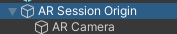
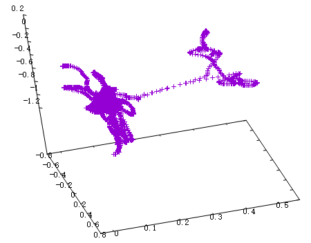

# ARFoundation - 相机姿态探索

https://docs.unity3d.com/Packages/com.unity.xr.arfoundation@4.1/manual/index.html

## 结论

该场景下，ARSession创建之后，对应的Origin是不变的，挂载在下面的Camera的位置会更新。

## 相关概念

在创建ARFoundation Scene的之后，首先需要在场景中创建AR Session和AR Session Origin。



**AR Session Origin** 下面挂有AR Camera节点。

ARSessionOrigin的目的是将可跟踪特征（如平面和特征点）转换为其在场景中的最终位置、方向和比例。因为AR设备在“会话空间”中提供它们的数据，而“会话空间”是相对于AR会话开始的非标度空间，所以ARSessionOrigin执行到Unity空间的适当转换。当AR设备产生一个可追踪对象，如，平面，的时候，他们位于“session 空间”中，相对于设备的坐标系。当在unity中实例化成GameObject的时候，会有一个世界坐标系。那么为了让物体实例化到正确的位置，ARFoundation需要知道session origin在unity场景中具体的位置。

ARSessionOrigin允许你缩放虚拟内容，并对AR相机应用偏移。如果缩放或偏移ARSessionOrigin，那么ARCamera需要时ARSessionOrigin的子节点，因为ARCamera是session-driven，此设置允许AR摄像头和检测到的可追踪对象一起移动。

**AR Pose Driver**,用来根据设备追踪信息来驱动父对象的local posiiton和orientation。最常用的方式是，将其挂载到ARCamera object，用来驱动AR场景中相机位置和方向的变化。

## 调试相机相关参数

开启调试，手机启动调试模式，数据线连接电脑，

```
adb tcpip 5555
adb connect [yourip]
```

输出日志：

```
adb -s [yourip] logcat -s Unity -f c:\unity_log.txt
```

基于https://github.com/Unity-Technologies/arfoundation-samples SimpleAR示例，增加记录相机参数的日志。创建CameraPosRecord脚本，挂载到ARCamera下，代码如下：

```c#
using System;
using System.Collections;
using System.Collections.Generic;
using UnityEngine;

public class CameraPosRecord : MonoBehaviour
{
    [SerializeField]
    public GameObject arSessionOrigin;

    public static string ConvertToString(Vector3 vec3)
    {
        return Convert.ToString(vec3.x) + " " + Convert.ToString(vec3.y) + " " + Convert.ToString(vec3.z);
    }

    // Update is called once per frame
    void Update()
    {
        Debug.Log("AR Session Origin Position is: " + ConvertToString(arSessionOrigin.transform.position));
        Debug.Log("AR Session Rotate angle is   : " + ConvertToString(arSessionOrigin.transform.rotation.eulerAngles));
        Debug.Log("AR Camera Origin Position is : " + ConvertToString(transform.position));
        Debug.Log("AR Camera Rotate angle is    : " + ConvertToString(transform.rotation.eulerAngles));
    }
}
```

并在0,0,0出放置了一个立方体。

应用启动后，进入SimpleAR，并移动相机位置，

通过对日志的查看得：

- AR Session Origin Position一直为0,0,0，即应用刚进入的时候相机所处的位置；
- AR Session Rotate angle一直为0,0,0，即应用刚进入的时候相机所处的方向；
- AR Camera 的位置和朝向会发生变化。

假设日志文件为`D:/log.txt`，那么过滤出相机位置如下：

`select-string "AR Camera Origin Position" D:/log.txt | foreach-object {$_.tostring().split(":")[-1]} | out-file -Encoding utf8 D:/camera-position.txt`，

过滤相机方向如下：

`select-string "AR Camera Rotate angle" D:/log.txt | foreach-object {$_.tostring().split(":")[-1]} | out-file -Encoding utf8 D:/camera-angle.txt`。

相机位置变化图如下，利用下面脚本绘制：`gnuplot.exe -e "splot 'D:/camera-position.txt'"：



## 其他资料

- 日志查看：https://blog.csdn.net/yanhui2012/article/details/51586364
- Unity android真机调试：https://www.cnblogs.com/lonkiss/p/6599305.html


