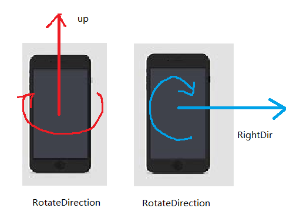
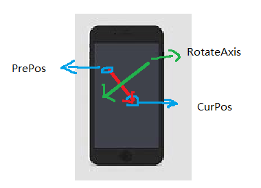
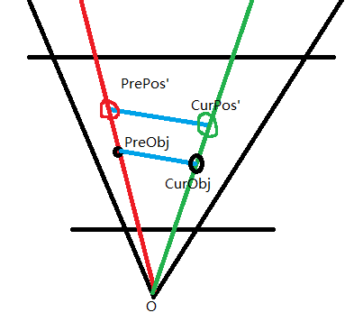
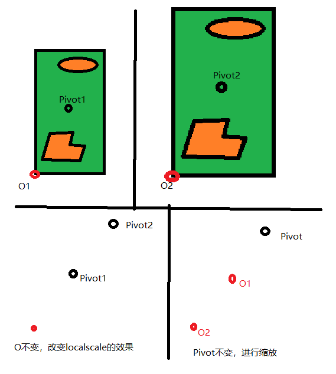

# ARFoundation - 实现物体旋转, 平移，缩放

本文目的是为了确定在移动端怎样通过单指滑动实现物体的旋转，双指实现平移和缩放。

前提知识：

[ARFoundation - touch point坐标点测试](./arfoundation-touch-point-coordinate.md)

## 旋转

手机的位置确定了相机的位置，那么首先确定下相机的updirection和rightdirection相对于手机屏幕指定的方向是哪。相关代码如下：

```c#
Object.transform.RotateAround(center, Camera.main.transform.up, rotateAngle);
```

物体相对于手机屏幕旋转示意如下：



为了实现物体的旋转，需要确定如下几个元素：

- 旋转轴；
- 旋转中心；
- 旋转角度；

### 确定旋转中心 

旋转中心定位物体的包围盒的中心，旋转轴获取的基本思路如下：



旋转轴的定义为，前一次操作的点，和当前操作的点，构成的向量，逆时针旋转90°（或顺时针旋转90°），即为旋转轴。

令PrePos->CurPos的向量为(x,y)，那么逆时针旋转90度得到的向量为(-y,x)，那么最后的RotateAxis为：

```c#
RotateAxis = Camera.main.transform.right * y + Camera.main.transform.up * (-x)
```

### 确定旋转角度

旋转的正角度方向，是通过左手确定的，即大拇指指向旋转轴的方向，四指弯曲的方向为旋转的正方向，为了保证四指弯曲的方向就是手指滑动的方向，于是需要保证旋转轴，为手指滑动方向顺时针旋转90°得到的向量，正如上一节中给出的结果。那么旋转角度的确定可以借助屏幕PrePos和CurPos之间的距离，与屏幕对角线之间距离（lenDiagnoal）的比值，以及旋转角度缩放量（angleZoom）确定（旋转的快慢可以通过调整该值确定），代码如下：

```c#
Vector2 delta = _curPos - _prePos;
int lenDiagnoal = Math.Min(Screen.width, Screen.height);
float deltaLength = delta.magnitude;
float angleZoom = 180.0f * 1.5f;
float rotateAngle = deltaLength / lenDiagnoal * angleZoom;
```

## 平移



由于相机的投影是基于透视投影的，如果直接将屏幕点转换到世界坐标系中，那么屏幕中不同的点转换后可能得到相同的世界坐标系的点。因此，在转化的时候需要在第三个维度上添加一个增量。转换后的点分别为：PrePos'和CurPos'。PreObj表示的是物体在上一帧的实际位置，CurObj表示物体在当前帧的实际位置，那么三角形O(PreObj)(CurObj)和三角形O(PrePos')(CurPos')相似，那么就可以计算得到平移向量(CurObj)(PreObj)。**需要注意的是，如果平移过程中，相机的位置变化了，可能得到预期外的结果**。为了控制平移量的大小，给定了translateScale值，代码如下：

```c#
Vector3 curPositionInWorld = Camera.main.ScreenToWorldPoint(new Vector3(_curPos.x, _curPos.y, 1));
Vector3 prePositionInWorld = Camera.main.ScreenToWorldPoint(new Vector3(_prePos.x, _prePos.y, 1));
var posDis = (curPositionInWorld - prePositionInWorld).magnitude; // prepos' to curpos'
var objDis = (TissueGroup.transform.position - Camera.main.transform.position).magnitude; // preobj to o
var preDis = (prePositionInWorld - Camera.main.transform.position).magnitude; // preobj' to o
var offset = objDis / preDis * posDis; // preobj to curobj length
Vector3 translateVecInWorld = (curPositionInWorld - prePositionInWorld).normalized * offset;// preobj to curobj vector
float translateScale = 0.5f;
TissueGroup.transform.position += translateVecInWorld * translateScale;
```

## 缩放

缩放需要以特定点为pivot点进行缩放。而unity自带的localscale是依据local坐标系的原点进行缩放的。具体实现可以参考：https://forum.unity.com/threads/scale-around-point-similar-to-rotate-around.232768/。

先来看一下示意图：



上面两个图是放大前后的样子。下面两个图是从两个角度出发，O不变，或Pivot不变的情况下，放大的示意图。显然，左下图中(Pivot2)(O)的距离等于右下图中(Pivot)O2的距离。那么基于pivot的缩放，可以理解：

- 计算平移向量，PivotO2；
- 将Pivot移动到O2；
- 进行放大；

代码实现如下：

```c#
var O1 = target.transform.localPosition;
var pivotToO1 = O1 - pivot1;
var pivotToO2 = pivotToO1 * scaleFactor;
var O2 = pivot + pivotToO2;
target.transform.localPosition = O2;
target.transform.localScale = target.transform.localScale * scaleFactor;
```

此时已经知道了如何基于pivot进行缩放，接下来需要确定的事情是，scaleFactor的计算。通过双指进行操作，双指间的距离增大的时候进行放大（距离差>0），双指间的距离减小的时候进行缩小（距离差<0）。那么需要寻找的函数是当x=0时，y=1，当x>0时y>1，当x<0时，y<1。同时y不会小于0。很容易想到满足该条件的是指数方程，那么可实现的一种示例如下（具体可以根据效果进行微调）：

```c#
Vector2 screenVec = new Vector2(Screen.width, Screen.height);
double scaleFactor = Math.Exp((curLength - preLength)/ screenVec.magnitude * 2.0);
```


