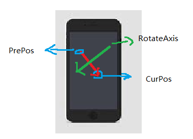

# ARFoundation - 实现物体Rotation, 平移，缩放

本文目的是为了确定在移动端怎样通过单指滑动实现物体的旋转，双指实现平移和缩放。

前提知识：

[ARFoundation - touch point坐标点测试](./arfoundation-touch-point-coordinate.md)

## 旋转

手机的位置确定了相机的位置，那么首先确定下相机的updirection和rightdirection相对于手机屏幕指定的方向是哪。相关代码如下：

```c#
Object.transform.RotateAround(center, Camera.main.transform.up, rotateAngle);
```

物体相对于手机屏幕旋转示意如下：


为了实现物体的旋转，需要确定如下几个元素：

- 旋转轴；
- 旋转中心；
- 旋转角度；

### 确定旋转中心 

旋转中心定位物体的包围盒的中心，旋转轴获取的基本思路如下：



旋转轴的定义为，前一次操作的点，和当前操作的点，构成的向量，逆时针旋转90°（或顺时针旋转90°），即为旋转轴。

令PrePos->CurPos的向量为(x,y)，那么逆时针旋转90度得到的向量为(-y,x)，那么最后的RotateAxis为：

```c#
RotateAxis = Camera.main.transform.right * y + Camera.main.transform.up * (-x)
```

### 确定旋转角度

旋转的正角度方向，是通过左手确定的，即大拇指指向旋转轴的方向，四指弯曲的方向为旋转的正方向，为了保证四指弯曲的方向就是手指滑动的方向，于是需要保证旋转轴，为手指滑动方向顺时针旋转90°得到的向量，正如上一节中给出的结果。


