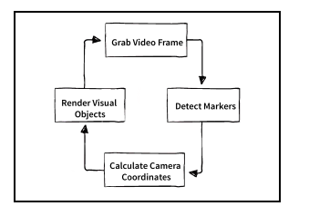
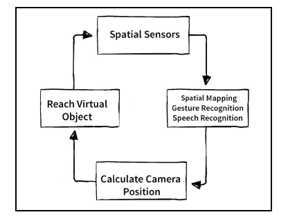
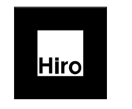
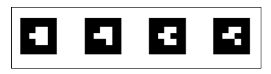
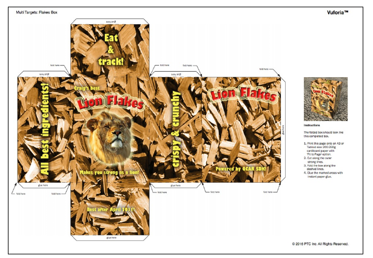

# Augmented Reality for Developers 阅读笔记

>  Augmented Reality for Developers Copyright © 2017 Packt Publishing

该书阅读的目的是为了进一步了解AR相关概念。以及用Unity进行AR Android的开发。

## 准备工作

- 没有网络摄像头，怎么办？安装ivCam，https://www.e2esoft.cn/ivcam

## Chapter 1: Augment Your World

AR的特点：

- Conbines real and virtual
- Interactive in real time
- Registered in 3D

### AR如何工作

文中涉及到两种AR模式：

- handheld mobile AR，通过手持式相机获取真实世界，然后和虚拟世界叠加显示；
- Optical eyewear AR

移动设备适用于AR场景中，有如下重要特点：

- 不受限制，电池供电；
-  平板图形显示触摸屏输入 ；
- 后置摄像头；
- CPU，GPU和内存；
- 运动传感器，即用于检测直线运动的加速度计和用于旋转运动的陀螺仪；
- GPS和/或其他位置传感器，用于地理定位以及与互联网的无线和/或Wi-Fi数据连接

Optical eyewear 设备通常包括如下：

- Lens optics， with aspecific field of view
- Forward-facing camera
- Depth sensors for positional tracking and hand recognition
- Accelerometer and gyroscopy for linear and rotational motion detection and near-ear audio speakers
- microphone

#### target-based AR

简单来说，

- 抓取视屏帧；
- 从视屏流中识别目标对象；
- 依据**photogrammetry技术**，获取目标对象相对于相机在三维空间的位置；
- 将物体渲染到对应的位置；

如下图所示：

#### 3D spatial mapping

扫描环境，构建空间三维网格。

对应的处理流程如下：

空间映射不限于具有深度感测相机的设备。利用巧妙的**摄影测量技术**，单靠软件就可以完成许多工作。例如，苹果iOS ARKit仅使用移动设备的摄像机，处理每一帧及其各种位置和运动传感器，将数据融合成环境的3D点云表示。谷歌ARCore的工作原理与此类似。vuforia sdk有一个类似的工具，尽管有更多的限制，叫做智能地形。

#### AR targets类别

AR的本质是让你的设备识别现实世界中的对象，并将计算机生成的图形渲染注册到同一3D空间，提供虚拟对象与你在同一物理空间的假象。targets的识别可以借助：Vuforia 

**1. Markers**

带有很宽边界的Marker，如下图：

**2. Coded Markers**

Vuforia 带有更强的marker system，VuMark。

**3. Images**

**4. Multi-targets**

**5. Text recognition**
**6. Simple shapes**
**7. Object recognition**
**8. Spatial maps**
**9. Geolocation**

## Chapter 2: Setting Up Your System 

使用Vuforia，参见：

https://library.vuforia.com/articles/Training/getting-started-with-vuforia-in-unity.html

此处需要注意的是，在update包的时候，由于“长城”的原因，无法更新成功，可以采用https://library.vuforia.com/articles/Solution/vuforia-engine-package-hosting-for-unity.html中介绍的第三步，Download Vuforia Engine SDK and Import Manually进行安装，相关实现参见：[Vuforia 9.0 更新小问题](https://blog.csdn.net/qq_43656250/article/details/105253109)。

## Chapter 4: Augmented Business Cards

这一章节主要内容：

- 计划AR项目开发；
- 创建Unity AR项目；

通常情况下对于所有的AR项目，在计划和实现的时候需要包括如下内容：

1. 决定使用的目标技术，比如，markers，images，objects，spatial map。对实际目标进行选择和预处理；
2. 选择和准备计算机图像资源（用于增强显示）；
3. 创建unity项目和创建新的场景；
4. 添加ARCamera；
5. 插入AR目标的placeholder，用于放置特殊的目标图像；
6. 插入当目标识别后会出现的内容；
7. 在unity editor中进行测试；
8. 构建应用，发布到AR设备；

获取3D模型的网站：

- https://sketchfab.com
- http://www.turbosquid.com
- http://www.blendswap.com

### 怎样的image target算是好的呢？

-  目标本身应该有一个亚光处理，以避免反射和镜面高光，这可能会混淆识别软件在运行时处理视频；
- 需要是刚性的，不易变形的；
- 图像应该有一个边界，这样就可以很容易地从背景中区分出来。建议这个边界应该大约是图像大小的8%。周围的边界可以是白色的。也可以是纹理的一部分。但请记住，8%的边境线将不会考虑到；
- 现实生活中的图像目标必须足够大，以提供足够数量的像素，其识别算法才能工作。一个粗略的公式是，图像宽度应该是距相机距离的十分之一。例如，给定一个大约4英尺远（50英寸）的桌面，图像应该至少有5英寸宽（即120厘米的距离和12厘米的宽度）；当目标较低时，除了近距离移动相机外，还有其他解决方案。您可以使用高度可识别的特殊标记，而不是任意图像。标记甚至可以像图形编码一样用QR码编码，这样一个给定的标记设计就可以被几十个独立的虚拟对象使用和识别；
- 它应该是详细的、非对称的、非重复的；
- 需要有好的对比度；

**这个章节的另外部分介绍了如何制作animation（这部分的学习放到别的地方）。**

## Chapter 6: How to change a flat tire

**TODO：可以学一下，如何利用利用MVC的方式进行开发**

## other

其他的章节忽略。