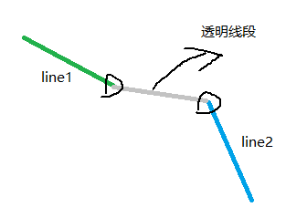

# Unity 绘制带颜色的流线 streamline

在[How to render streamlines in Unity?](https://stackoverflow.com/questions/52059750/how-to-render-streamlines-in-unity)中介绍了如何绘制一条streamline，代码如下：

```c#
[RequireComponent(typeof(MeshFilter))]
[RequireComponent(typeof(MeshRenderer))]
public class LineStrip : MonoBehaviour {

    void Start() {       
        GetComponent<MeshRenderer>().material = new Material(Shader.Find("Sprites/Default"));

        int n = 512;    
        Vector3[] verts = new Vector3[n];
        Color[] colors  = new Color[n];
        int[] indices = new int[n];

        for (int i = 0; i < n; i++)
        {
            // Indices in the verts array. First two indices form a line, 
            // and then each new index connects a new vertex to the existing line strip
            indices[i] = i;
            // Vertex colors
            colors [i] = Color.HSVToRGB( (float)i/n, 1, 1 );
            // Vertex positions
            verts[i] = new Vector3( i / 64f, Mathf.Sin( i/32f ), 0);
        }

        Mesh m = new Mesh
        {
            vertices = verts,
            colors = colors
        };

        m.SetIndices(indices, MeshTopology.LineStrip, 0, true);

        GetComponent<MeshFilter>().mesh = m;
    }   
}
```

此处有一个问题，如何高效的绘制多条streamline呢？加入有1000条?创建1000个gameobject？？还是说有别的方法？

当然，很明显的，如果通过绘制1000个gameobject，那么会出现多次drawcall，这会显著的影响绘制性能。这里可以借用一个trick的办法。在两条线中间添加一个不可见的线段。这样就可以将1000条线合并成一条线进行绘制。假设lines文件中的内容如下，其中每一行由顶点的三个坐标，和三色的三个通道组成。

```
1.05 18.5 74.3 9 13 254 255
2.18 14.9 66.7 97 85 219 255
6.29 11.5 59.2 117 118 192 255
8.94 6.28 53.1 85 127 203 255
==============
5.54 1.99 45.7 211 15 142 255
1.3 0.671 42.5 219 52 119 255
-2.82 -0.496 39.9 232 103 10 255
-6.96 -1.43 38.5 243 33 68 255
-11.3 -2.24 37.5 251 35 24 255
==============
-15.2 -2.67 37.7 244 4 71 255
-19.5 -2.44 39 91 126 201 255
-23.5 -2.06 41.1 229 28 107 255
-27.7 -1.98 43.8 69 234 71 255
-31.3 0.0787 51.9 36 35 249 255
==============
-28.4 3.98 59.3 106 90 213 255
-24.4 8.02 66.2 114 82 212 255
-20.6 13.3 73.7 95 114 206 255
-17.5 18.1 76.8 106 231 2 255

```

针对2条streamline绘制的示例代码如下：

```c#
void Start()
{
    GetComponent<MeshRenderer>().material = new Material(Shader.Find("Sprites/Default"));

    List<Vector3> verts = new List<Vector3>();
    List<Color32> colors = new List<Color32>();
    List<int> indices = new List<int>();

    var lines = File.ReadAllLines("lines.txt");

    var linesCount = lines.Length;
    var index = 0;
    bool preIsSeperator = false;
    int i = 0;
    try
    {
       for (; i < linesCount; ++i)
       {
           var line = lines[i].Trim();
           if (string.IsNullOrEmpty(line))
           {
               continue;
           }
           if (line.StartsWith("===")) // 用===作为两条线的分隔符
           {
               // 1. add transparent point at end position of one line
               verts.Add(verts[verts.Count - 1]);
               colors.Add(new Color(0, 0, 0, 0));
               indices.Add(index++);

               // 2. add transparent point at (0,0,0) position
               if (i != linesCount - 1)
               {
                   verts.Add(new Vector3(0, 0, 0));
                   colors.Add(new Color(0, 0, 0, 0));
                   indices.Add(index++);
               }

               preIsSeperator = true;
               continue;
           }

           var values = line.Split();
           var vertex = new Vector3(float.Parse(values[0]), float.Parse(values[1]), float.Parse(values[2]));
           var color = new Color32(int.Parse(values[3]), int.Parse(values[4]), int.Parse(values[5]), int.Parse(values[6]));

           if (preIsSeperator)
           {
               // 3. add transparent point at start position of one line
               verts.Add(vertex);
               colors.Add(new Color(0, 0, 0, 0));
               indices.Add(index++);
               preIsSeperator = false;
           }
           verts.Add(vertex);
           colors.Add(color);
           indices.Add(index++);
       }

    }
    catch
    {
       Debug.Log(i);
    }


    Mesh m = new Mesh
    {
       vertices = verts.ToArray(),
       colors32 = colors.ToArray()
    };

    m.SetIndices(indices.ToArray(), MeshTopology.LineStrip, 0, true);

    GetComponent<MeshFilter>().mesh = m;
}
```

中间衔接的示意图如下：



## 参考

- https://forum.unity.com/threads/how-to-draw-lines-in-unity-efficiently.512900/
- https://stackoverflow.com/questions/52059750/how-to-render-streamlines-in-unity
- https://docs.unity3d.com/ScriptReference/Mesh.SetIndices.html

