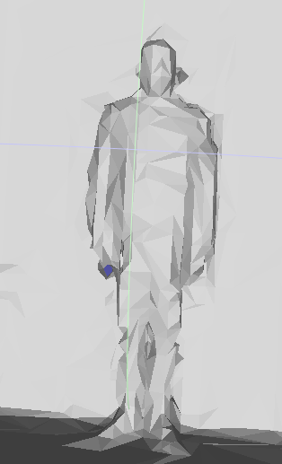
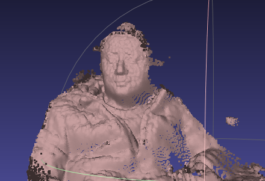

# 通过Hololens 2采集网格数据

## Using Spatial Mapping to acquare mesh data

https://forums.hololens.com/discussion/9827/how-to-detect-a-real-object-using-hololens-for-unity

需要包括的内容有：

- 实现hololens通过spatial mapping采集对应的网格数据；
- 将网格数据存储到Hololens2的内部目录；

### 实现通过Hololens 2采集网格数据

帮助文档有：

- [空间感知系统](https://hololenscndev.github.io/MRTKDoc/Documentation/SpatialAwareness/SpatialAwarenessGettingStarted.html)
- [为设备设置observers](https://hololenscndev.github.io/MRTKDoc/Documentation/SpatialAwareness/ConfiguringSpatialAwarenessMeshObserver.html)
- [通过代码控制Observers](https://hololenscndev.github.io/MRTKDoc/Documentation/SpatialAwareness/UsageGuide.html)

### 将网格数据存储到Hololens2的内部目录

文件读写参见：

- http://longqian.me/2017/02/08/hololens-file-transfer/
- https://blog.csdn.net/qq_41452267/article/details/109029998
- https://www.cnblogs.com/bwzydr/p/6858370.html

### 具体实现

更改`SpatialAwarenessMeshDemo.unity`demo中的`ClearSpatialObservations.cs`脚本实现，主要增加网格输出，具体如下：

```c#
// Copyright (c) Microsoft Corporation.
// Licensed under the MIT License.

using Microsoft.MixedReality.Toolkit.SpatialAwareness;
using UnityEngine;
using System.Text;

#if !UNITY_EDITOR && UNITY_METRO
using System.IO;
using Windows.Storage;
using System.Threading.Tasks;
using System;
using System.Threading;
#endif

namespace Microsoft.MixedReality.Toolkit.Examples.Demos
{
    /// <summary>
    /// This class demonstrates clearing spatial observations.
    /// </summary>
    [AddComponentMenu("Scripts/MRTK/Examples/ClearSpatialObservations")]
    public class ClearSpatialObservations : MonoBehaviour
    {
        private string[] filenames = { "filename1.obj", "filename2.obj" };
        private int count = 0;

        public void WriteString(string s, string filename)
        {
#if !UNITY_EDITOR && UNITY_METRO
            string foldername = ApplicationData.Current.RoamingFolder.Path;
            Task task = new Task(
                async () => {
                    StorageFolder folder = await StorageFolder.GetFolderFromPathAsync(foldername);
                    StorageFile file = await folder.CreateFileAsync(filename, CreationCollisionOption.ReplaceExisting);
                    await FileIO.WriteTextAsync(file, s);
            });
            task.Start();
            task.Wait();
#endif
        }

        public static string MeshToString(MeshFilter mf)
        {
            Mesh m = mf.mesh;
            Material[] mats = mf.GetComponent<MeshRenderer>().sharedMaterials;

            StringBuilder sb = new StringBuilder();

            sb.Append("g ").Append(mf.name).Append("\n");
            foreach (Vector3 v in m.vertices)
            {
                sb.Append(string.Format("v {0} {1} {2}\n", v.x, v.y, v.z));
            }
            sb.Append("\n");
            foreach (Vector3 v in m.normals)
            {
                sb.Append(string.Format("vn {0} {1} {2}\n", v.x, v.y, v.z));
            }
            sb.Append("\n");
            foreach (Vector3 v in m.uv)
            {
                sb.Append(string.Format("vt {0} {1}\n", v.x, v.y));
            }
            for (int material = 0; material < m.subMeshCount; material++)
            {
                sb.Append("\n");
                sb.Append("usemtl ").Append(mats[material].name).Append("\n");
                sb.Append("usemap ").Append(mats[material].name).Append("\n");

                int[] triangles = m.GetTriangles(material);
                for (int i = 0; i < triangles.Length; i += 3)
                {
                    sb.Append(string.Format("f {0}/{0}/{0} {1}/{1}/{1} {2}/{2}/{2}\n",
                        triangles[i] + 1, triangles[i + 1] + 1, triangles[i + 2] + 1));
                }
            }
            return sb.ToString();
        }

        /// <summary>
        /// Indicates whether observations are to be cleared (true) or if the observer is to be resumed (false).
        /// </summary>
        private bool clearObservations = true;

        /// <summary>
        /// Toggles the state of the observers.
        /// </summary>
        public void ToggleObservers()
        {
            var observer = CoreServices.GetSpatialAwarenessSystemDataProvider<IMixedRealitySpatialAwarenessMeshObserver>();
            foreach (SpatialAwarenessMeshObject meshObject in observer.Meshes.Values)
            {
                count++;
                var content = MeshToString(meshObject.Filter);
                WriteString(content, filenames[count%2]);
            }

            var spatialAwarenessSystem = CoreServices.SpatialAwarenessSystem;
            if (spatialAwarenessSystem != null)
            {
                if (clearObservations)
                {
                    spatialAwarenessSystem.SuspendObservers();
                    spatialAwarenessSystem.ClearObservations();
                    clearObservations = false;
                }
                else
                {
                    spatialAwarenessSystem.ResumeObservers();
                    clearObservations = true;
                }
            }
        }
    }
}
```

### 示例结果如下



## 利用research mode中的StreamReacorderConverter

https://github.com/microsoft/HoloLens2ForCV

### Depth AHaT示例结果如下



## 小结

- 利用spatial mapping生成的网格很粗糙；
- Depth AHaT research mode的点云密度明显提升；