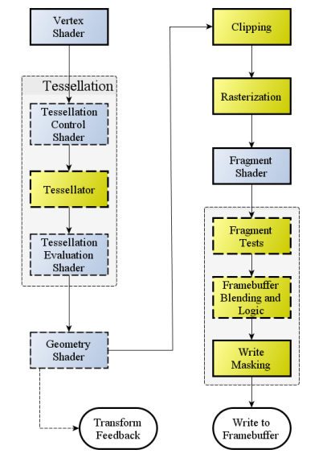
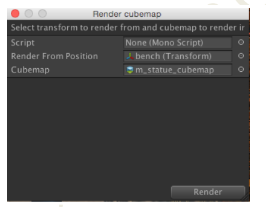

# 《Unity Shader编程》阅读笔记

电子书见：https://www.jb51.net/books/505524.html

## 渲染管线




1. ⽤户给 GPU 喂顶点数据给流⽔线，顶点数据是⼀组属性，诸如位置、法线、颜⾊之类的组合信息。然后通过 API(所谓的 drawcall)让 GPU 渲染; 
2. 上图中的 Vertex Shader 接⼿处理每个顶点，对 Vertex Shader 来说，得到的输⼊就是第⼀步给到的信息流中的每个顶点属性；⾄于输出什么，在可编程管线中，完全是看⽤户写的代码要做什么。当然，这个步骤输出的信息有⼀定约束，⾄少有⼀个“位置(position)”信息必须被输出，作为⼀个有效的顶点信息
3. 元件组装（Primitive Assembly），对于 OpenGL 来说，元件有 3 种，点、线和三⾓形。从第⼆步出来的顶点数据，再结合⽤户喂给流⽔线的其他数据（告知这些顶点之间的关系），会被这个过程组装成这三个类型中的⼀种。镶嵌/或者说是细分（Tessellation)会在此后运⾏，让前⾯的primitive 能被细分成更⼩的元件以满⾜不同的精度需求
4. ⼏何体着⾊器（Geometry Shader)，该着⾊器得到第三步出来的 primitive，它的输出是 0 个或者更多的 primitives
5. Transform Feedback，在 OpenGL 这⾥，⼏何体着⾊器后可以吐出相关的 primitive到所谓的缓冲物体(buffer object)中（其实就是定义好格式的⼀些数据结构），这些buffer object 可以被保存⽤作其他的作⽤。如果在这⾥抛弃流⽔线后续的⼯作，那么整个流⽔线的产出就是这些东西
6. 顺图中的实线，后续是裁剪（Clipping）。根据⽤户设置的视椎体的可视范围，primitives会被剔除（整体在可视范围外），部分在外的则被按照规则切割成⼏个 primitives。在现在的 GPU 上，⽤户除了视椎体，也可以通过裁剪⾯（Clip plane）来指定额外的裁剪信息。在 3D 中，⼤多数是单⾯的 primitive，这个时候，背⾯朝向相机的primitive 也会被裁剪掉。
7. 能达到光栅化（Rasterization）这步的物体，会被这个步骤进⾏光栅化，举例来说，⼀个三⾓形 primitive，会产⽣填充其内部的许多所谓的碎⽚（fragment）。fragment跟 pixel（像素）不同的地⽅在于，在专业⾓度，它是⼀系列信息，⽤来判断对应的像素最后的数据。
8. 碎⽚着⾊器（Fragment Shader）得到上⾯处理出来的数据，然后运⾏⽤户给定的⼀段程序，计算出最后的像素的相关信息。它的输出是⼀系列的值：颜⾊和深度信息
9. fragment shader 的输出进⼊ Fragment Tests 这个阶段，会⾸先进⾏ Alpha 测试（alpha test），继⽽模板测试（stencil test），如果 fragment 没有经过测试，那么就不会进⼊到最后的缓冲区（framebuffer）；然后进⾏深度测试（depth test），如果通不过，就不会进⼊ framebuffer。【注：OpenGL 的相关⽂档有提到，如果 fragment shader对 fragment 的深度不会修改，那么这个测试可以提到 fragment shader 之前，所谓的“Early Z Test”】
10. Blending 是后续的⼯作，如果 fragment 可以被写⼊ framebuffer，则这个 fragment和已经在 framebuffer 中的值可以做⼀定的混合，实现不同的效果，举例，半透明效果。
11. 上⼀步出来的值，就准备开始往 framebuffer 中写了，写的时候可以通过 Writing Mask来控制哪些值要写到 framebuffer，可以控制到颜⾊、深度、模板值，也可以控制到颜⾊的某个通道
12. 结束。

## 如何写surface shader

相关资源：

- 常用的cg内置函数，见：https://www.cnblogs.com/Jason-c/p/8390822.html
- shader语法介绍，见：https://www.cnblogs.com/Jason-c/p/8385946.html
- 纹理资源，见：https://c4dsky.com/41939.html
- 法向量贴图生成，见：https://github.com/kmkolasinski/AwesomeBump

(1) ⽤#pragma surface surf_func来定义surface具体的方法名称，这个命令不能写在Pass中，因为 surface shader 会被翻译成相应的Pass；

(2) surface 函数形式为：`void surf (Input IN, inout SurfaceOutput o)`，第一个参数填上shader需要从外部送进来的数据，比如UV，Unity 运⾏的时候，会根据这个结构知道该给本 shader 喂哪些数据，Input中可以设置的值有：

```cg
float3 viewDir
float4 变量 ⽤ COLOR 这个语义关键词来后置修饰
float4 screenPos
float4 worldPos
float3 worldRefl  // 世界坐标系的反射方向
float3 worldNormal
```

还可以是uv值，这个只要在对应的贴图的名字前⾯加上 `uv_`这个前缀，比如 `_MainTexture`对应的为`uv_MainTexture`

(3) 第⼆个参数是⼀个 Unity 预定义的结构，前⾯⽤ inout 这个关键词来修饰，表⽰这个结构是个输⼊输出都会⽤到的东西。标准的结构如下:

```glsl
struct SurfaceOutput
{
    fixed3 Albedo;    // 光源的反射率
    fixed3 Normal;    // 法向量
    fixed3 Emission;  // 自发光
    half Specular;    // 光反射中的指数部分的系数; 
                      // float spec = pow (nh, s.Specular*128.0) * s.Gloss;  
    fixed Gloss;      // 高光反射中的强度系数
    fixed Alpha;      // 通常理解的透明通道
}
```

unity5之后有：

```glsl
struct SurfaceOutputStandard
{
    fixed3 Albedo;
    fixed3 Normal;
    fixed3 Emission;
    half Metallic;
    half Smoothness;
    half Occlusion;
    fixed Alpha;
}

struct SurfaceOutputStandardSpecular
{
    fixed3 Albedo;
    fixed3 Normal;
    fixed3 Emission;
    half3 Emission;
    half Smoothness;
    half Occlusion;
    fixed Alpha;
}
```

(4) 然后在这个⽅法中，我们会把⼀个 Unity 预定义的结构中的相应的值（不需要所有）填好值就完成了整个 shader 的⼯作.

## 高亮效果

lambert光照模型：https://www.cnblogs.com/jqm304775992/p/4887779.html，没法实现高亮效果。

[Phong和Blinn-Phong光照模型](https://www.cnblogs.com/bluebean/p/5299358.html)

## 使用unity生成cubemap

(1) 建⽴⼀个场景，在场景⾥放⼊多个物体，尽量放置不同的物体形状，并且保持数量和⼤⼩能保证我们的相机在某个点拍摄的时候，六个⽅向上都有东西拍到。如果有真实的场景，那就最好；

(2) 在 Project ⾯板中创建⼀个 Editor ⽂件夹，因为我们需要在这⾥放置⼀个代码⽂件来做 cubemap ⽣成；

(3) 在 Editor ⽂件夹中创建⼀个 c#脚本，名字为 GenerateCubemap；

```c#
using UnityEngine;
using UnityEditor;
using System.Collections;

public class GenerateCubemap : ScriptableWizard
{
    public Transform renderFromPosition;
    public Cubemap cubemap;
    
    void OnWizardUpdate()
    {
        helpString = "Select transform to render from and cubemap to render int o";
        isValid = (renderFromPosition != null) && (cubemap != null);
    }
    
    void OnWizardCreate()
    {
        GameObject go = new GameObject("Cubemap Camera", typeof(Camera));
        go.transform.position = renderFromPosition.position;
        go.transform.rotation = Quaternion.identity;
        
        go.camera.RenderToCubemap(cubemap);
        
        DestroyImmediate(go);
    }
    
    [MenuItem("Tool/Render into Cubemap")]
    static void RenderCubemap()
    {
        StriptableWizard.DisplayWizard("Render cubemap", typeof(GenerateCubemap), "Render");
    }
}
```

(4) 保存后回到 Unity。我们应该在 Unity 的主菜单上看到多了⼀个 Tool，点开会出现下拉菜单“Render into Cubemap"。

(5) 点击该菜单，出现如下对话框



其中，第二栏是从场景中拖拽进去的物体，表示拍照相机的位置；第三栏是project面板上创建的cubemap文件（5.0 位于legacy中）。cubemap文件的Readable选项需要选中；

(6) 点击Render，写入cubemap文件。

## 环境映射

```glsl
Shader "Custom/Envmap"
{
    Properties
    {
        _MainTex ("Albedo (RGB)", 2D) = "white" {}
        _Cubemap ("Env map", CUBE) = "" {}
    }

    SubShader
    {
        Tags { "RenderType"="Opaque" }
        LOD 200

        CGPROGRAM
        // Physically based Standard lighting model, and enable shadows on all light types
        #pragma surface surf Lambert 

        // Use shader model 3.0 target, to get nicer looking lighting
        #pragma target 3.0

        sampler2D _MainTex;
        samplerCUBE _Cubemap;

        struct Input
        {
            float2 uv_MainTex;
            float3 worldRefl;
        };


        void surf (Input IN, inout SurfaceOutput o)
        {
            // Albedo comes from a texture tinted by color
            fixed4 c = tex2D (_MainTex, IN.uv_MainTex);
            o.Albedo = c.rgb;

            fixed4 refcol = texCUBE(_Cubemap, IN.worldRefl);
            refcol *= c.a;

            o.Emission = refcol.rgb;
            o.Alpha = refcol.a;
        }
        ENDCG
    }
    FallBack "Diffuse"
}
```

## 透明、Alpha混合

### 1. 用上 #pragma xxx alpha

此处使用的是`#pragma surface surfaceFunction lightModel [optionalparams]`，其中lightModel是Lambert或者BlinnPhong，或者自定义。此处alpha为optionalparams，alpha 字段⽤在这⾥指⽰ Unity 编译器我们的 shader 需要启⽤ alpha 混合(alpha blend)的功能，这样 unity 引擎会为我们打开这个开关。

### 2.  surface shader 的 alpha 值⼀定要放置好正确的值。0 会让相应的 texel(对应于贴图中的每个像素，渲染到显⽰缓存的每个最终单位叫做 texel)消失。

### 3. 一定让透明物体在不透明物体后面渲染

透明物体的渲染背后是：shader 每个输出的 texel 都会跟原来在显⽰缓存⾥的 texel 做 alpha混合。可以用unity中的tag来控制渲染顺序，如`Tags { "Queue" = "Transparent" }

## Alphatest

alphatest 常⽤在树叶、⽑发的渲染场合，⽽且经常跟 alpha 混合⼀起使⽤达到⽐较完美的输出。前者⽤于先取出 alpha 值⾮常⼩的部分，后者⽤来实现边缘的半透明化。

## 顶点颜色设置

shader代码如下：

```glsl
Shader "Custom/grassandmud"
{
    Properties
    {
        _MainTex ("Albedo (RGB)", 2D) = "white" {}
    }
    SubShader
    {
        Tags { "RenderType"="Opaque" }
        LOD 200

        CGPROGRAM
        #pragma surface surf Lambert vertex:vert // vert对应后面的函数名称

        // Use shader model 3.0 target, to get nicer looking lighting
        #pragma target 3.0

        sampler2D _MainTex;

        struct Input
        {
            float2 uv_MainTex;
            float4 vertColor;
        };


        void vert(inout appdata_full v, out Input o)
        {
			UNITY_INITIALIZE_OUTPUT(Input, o);
            o.vertColor = v.color;
        }

        void surf (Input IN, inout SurfaceOutput o)
        {
			o.Albedo = IN.vertColor.rgb * tex2D(_MainTex, IN.uv_MainTex).rgb;
        }
        ENDCG
    }
    FallBack "Diffuse"
}

```

appdata_full如下：

```glsl
struct appdata_full
{
float4 vertex : POSITION;
float4 tangent : TANGENT;
float3 normal : NORMAL;
float4 texcoord : TEXCOORD0;
float4 texcoord1 : TEXCOORD1;
fixed4 color : COLOR;
#if defined(SHADER_API_XBOX360)
half4 texcoord2 : TEXCOORD2;
half4 texcoord3 : TEXCOORD3;
half4 texcoord4 : TEXCOORD4;
half4 texcoord5 : TEXCOORD5;
#endif
}
```

包括位置，切线，法向量，纹理坐标，颜色。

设置颜色脚本代码示例如下：

```c#
using System.Collections;
using System.Collections.Generic;
using UnityEngine;

public class MeshColor : MonoBehaviour
{
    // Start is called before the first frame update
    void Start()
    {
        Mesh mesh = GetComponent<MeshFilter>().mesh;
        Vector3[] vertices = mesh.vertices;
        Color[] colors = new Color[vertices.Length];

        colors[0] = Color.red;
        colors[1] = Color.green;
        colors[2] = new Color(199.0f / 255.0f, 195.0f / 255.0f, 0);
        colors[3] = new Color(199.0f / 255.0f, 195.0f / 255.0f, 0);

        mesh.colors = colors;
    }
}
```

## others

更多的shader效果实现的具体资料将通过其他的内容见进行学习。