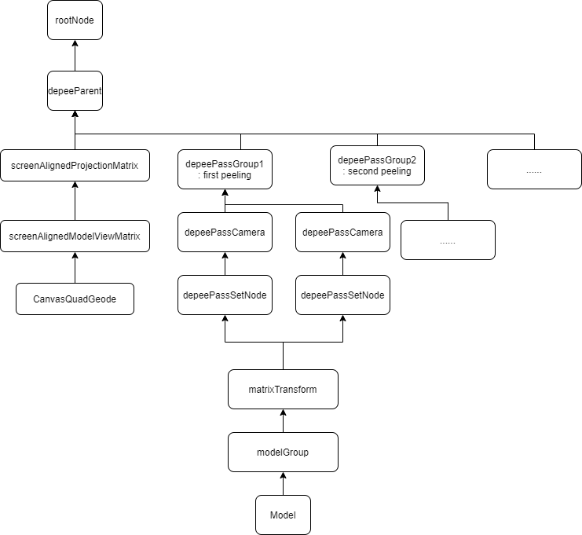

# osg - sourcecode - glsl相关示例代码阅读

[toc]

## osgatomiccounter

相关阅读：https://blog.csdn.net/csxiaoshui/article/details/33740065 ，http://www.3wwang.cn/html/article_132.html

program的创建如下：

```c++
osg::Program * createProgram()
{

  std::stringstream vp;
  vp << "#version 420 compatibility\n"
     << "\n"
     << "void main(void)\n"
     << "{\n"
     << "    gl_Position = ftransform();\n" // 与gl_ProjectionMatrix * gl_ModelViewMatrix * gl_Vertex;  一致
     << "}\n";
  osg::Shader * vpShader = new osg::Shader( osg::Shader::VERTEX, vp.str() );

  std::stringstream fp;
  fp << "#version 420 compatibility\n"
     << "\n"
     << "layout(binding = 0) uniform atomic_uint acRed;\n"
     << "layout(binding = 0, offset = 4) uniform atomic_uint acGreen;\n"
     << "layout(binding = 2) uniform atomic_uint acBlue;\n"
     << "\n"
     << "uniform float invNumPixel;\n"
     << "\n"
     << "void main(void)\n"
     << "{\n"
             // 计算颜色值
     << "    float r = float(atomicCounterIncrement(acRed)) * invNumPixel;\n"
     << "    float g = float(atomicCounterIncrement(acGreen)) * invNumPixel;\n"
     << "    float b = float(atomicCounterIncrement(acBlue)) * invNumPixel;\n"
     << "    gl_FragColor = vec4(r, g, b, 1.0);\n"
     << "}\n"
     << "\n";

  //  ......

  return program;
}
```

上面代码中关于binding，以及offset的介绍可以参见：https://blog.csdn.net/csxiaoshui/article/details/33740065。简答的来说，对于：

```glsl
layout(binding = 0) uniform atomic_uint acRed;
layout(binding = 0, offset = 4) uniform atomic_uint acGreen;
layout(binding = 2) uniform atomic_uint acBlue;
```

直接用OpenGL的示例代码如下：

```c++
glGenBuffers(1, &acboRedAndGreen);
glBindBuffer(GL_ATOMIC_COUNTER_BUFFER, acboRedAndGreen);
glBufferData(GL_ATOMIC_COUNTER_BUFFER, sizeof(GLuint)*2, NULL, GL_STREAM_COPY);
// 这里的第三个参数，sizeof(GLuint)*2，指定了传入数据的大小，为2个uint，占2*4个byte，
// offset = 0, 指的前4个bytes
// offset = 1，指的后4个bytes
glBufferSubData(GL_ATOMIC_COUNTER_BUFFER, 0, sizeof(GLuint)*2, atomicCounterArrayRedAndGreen);
// 这里的第二个参数0，就是binding对应的值
glBindBufferBase(GL_ATOMIC_COUNTER_BUFFER, 0, acboRedAndGreen); 
```

invNumPixelUniform个更新如下：

```c++
class AdaptNumPixelUniform : public osg::Camera::DrawCallback
{
    public:
        virtual void operator () (osg::RenderInfo& renderInfo) const
        {
            // 读取数据获取当前记录的最大数值
            _acbb->readData(*renderInfo.getState(), *_atomicCounterArray);
            unsigned int numPixel = osg::maximum(1u, _atomicCounterArray->front());

            if ((renderInfo.getView()->getFrameStamp()->getFrameNumber() % 10) == 0)
            {
                OSG_INFO << "osgatomiccounter : draw " << numPixel << " pixels." << std::endl;
            }

            // 将其设置到uniform状态中
            _invNumPixelUniform->set( 1.0f / static_cast<float>(numPixel) );
        }
};
```

bufferobject创建，bufferbinding代码如下(以RedAndGreen为例)：

```c++
osg::ref_ptr<osg::UIntArray> atomicCounterArrayRedAndGreen = new osg::UIntArray;
atomicCounterArrayRedAndGreen->push_back(0);
atomicCounterArrayRedAndGreen->push_back(0);

osg::ref_ptr<osg::AtomicCounterBufferObject> acboRedAndGreen = new osg::AtomicCounterBufferObject;
acboRedAndGreen->setUsage(GL_STREAM_COPY);
atomicCounterArrayRedAndGreen->setBufferObject(acboRedAndGreen.get());

// AtomicCounterBufferBinding的参数解释如下：
// @param index the index target，对应shader中的binding，
// @param bd associated buffer data
// @param offset offset into buffer data
// @param size size of data in buffer data
osg::ref_ptr<osg::AtomicCounterBufferBinding> acbbRedAndGreen = new osg::AtomicCounterBufferBinding(0, atomicCounterArrayRedAndGreen.get(), 0, sizeof(GLuint)*3);
ss->setAttributeAndModes(acbbRedAndGreen.get());
```

然后在scenegraph遍历的时候，StateAttribute会调用apply函数，`AtomicCounterBufferBinding`对应的apply函数为：

```c++
void BufferIndexBinding::apply(State& state) const
{
    if (_bufferData.valid())
    {
        // 此处bufferData对应的是atomicCounterArrayRedAndGreen
        GLBufferObject* glObject
            = _bufferData->getBufferObject()->getOrCreateGLBufferObject(state.getContextID());
        if (glObject->isDirty()) glObject->compileBuffer();
        // bind a range within a buffer object to an indexed buffer target
        glObject->_extensions->glBindBufferRange(_target, _index,
                glObject->getGLObjectID(), glObject->getOffset(_bufferData->getBufferIndex())+_offset, _size-_offset);
    }
}
```

一帧结束之后，通过callback，将BufferData设置成dirty，用来初始化数据。

## osgblenddrawbuffers

### 补充知识

相关阅读：http://www.3wwang.cn/html/article_136.html ， http://www.3wwang.cn/html/article_116.html

**关于`gl_Color`的理解**，可以参见：https://kb.kutu66.com/opengl/post_1269552 。在片段着色器中， `gl_Color`表示对三角形进行顶点颜色插值后得到的颜色。

**关于`gl_FragData`**：写入的 `gl_FragColor` 值定义了后续固定功能管线中使用的片段的颜色。而变量 `gl_FragData` 是一个数组，写入的数值 `gl_FragData[n]` 指定了后续固定功能管线中对应于数据 `n` 的片段数据。

**帧缓冲区（FrameBuffer）**：用作画类比，OpenGL也需要一个画板来放置不同的画布呈现不同的图像。**Framebuffer就是画板**（不能用通常的内存缓冲区进行理解），**画布**可以**是纹理（Texture）或者渲染缓冲区（RenderBuffer）**，放置这些**画布的位置**在OpenGL中称为帧缓冲的附着（**Attachment**）。

### 代码阅读

该示例的主要流程如下4个步骤：

```c++
int main()
{
    // 1. Create a camera to output multi-rendering-targets (MRT)
    osg::ref_ptr<osg::Camera> mrtCam = createMRTCamera( textures );
    mrtCam->addChild( cessna );
    
    // 2. Create shader program to be used
    const char* mrtFragmentCode = {
        "void main() {\n"
        "   gl_FragData[0] = gl_Color * vec4(1.0, 1.0, 1.0, 0.7);\n" // 结果输出到COLOR_BUFFER0对应的纹理中
        "   gl_FragData[1] = vec4(0.0, 1.0, 1.0, 0.0);\n" // 结果输出到COLOR_BUFFER1对应的纹理中
        "   gl_FragData[2] = vec4(1.0, 0.0, 1.0, 0.3);\n" // 结果输出到COLOR_BUFFER2对应的纹理中
        "   gl_FragData[3] = vec4(1.0, 1.0, 0.0, 1.0);\n" // 结果输出到COLOR_BUFFER3对应的纹理中
        "}\n"
    };
    osg::ref_ptr<osg::Program> program = new osg::Program;
    program->addShader( new osg::Shader(osg::Shader::FRAGMENT, mrtFragmentCode) );

    osg::ref_ptr<osg::StateSet> ss = mrtCam->getOrCreateStateSet();
    ss->setAttributeAndModes( program );

    // 3. Apply blending to the original scene in MRT
    // ......
    
    // 4. Create some quads to be shown on screen to contain the MRT result
    // ......
}
```

创建相机，建立附着和纹理之间的绑定关系，具体如下：

```c++
osg::Camera* createMRTCamera( std::vector<osg::Texture*>& attachedTextures )
{
    osg::ref_ptr<osg::Camera> camera = new osg::Camera;
    camera->setClearColor( osg::Vec4(0.0f, 0.0f, 0.0f, 1.0f) );
    camera->setClearMask( GL_COLOR_BUFFER_BIT|GL_DEPTH_BUFFER_BIT );
    // 设置目标为framebuffer
    camera->setRenderTargetImplementation( osg::Camera::FRAME_BUFFER_OBJECT );
    camera->setRenderOrder( osg::Camera::PRE_RENDER );

    // 创建纹理，并切合COLOR_BUFFER进行绑定
    for ( int i=0; i<4; ++i )
    {
        osg::Texture2D* tex = new osg::Texture2D;
        tex->setTextureSize( 1024, 1024 );
        tex->setInternalFormat( GL_RGBA );
        tex->setFilter( osg::Texture2D::MIN_FILTER, osg::Texture2D::LINEAR );
        tex->setFilter( osg::Texture2D::MAG_FILTER, osg::Texture2D::LINEAR );
        attachedTextures.push_back( tex );

        camera->setViewport( 0, 0, tex->getTextureWidth(), tex->getTextureHeight() );
        // 将纹理和附着进行绑定
        camera->attach( osg::Camera::BufferComponent(osg::Camera::COLOR_BUFFER0+i), tex );
    }
    return camera.release();
}
```

应用 blending，利用Enablei，BlendFunci，ColorMaski对各个输出进行分别设置：

```c++
        // Only enable blending on the first draw buffer so other three outputs are
        // totally opaque, which is important for MRT cases
        ss->setAttribute( new osg::Enablei(GL_BLEND, 0) );
        ss->setAttribute( new osg::Disablei(GL_BLEND, 1) );
        ss->setAttribute( new osg::Disablei(GL_BLEND, 2) );
        ss->setAttribute( new osg::Disablei(GL_BLEND, 3) );

        // Accept different blend/colormask attributes on multiple render targets
        osg::ref_ptr<osg::BlendFunci> blend0 = new osg::BlendFunci(0, GL_SRC_ALPHA, GL_ONE_MINUS_SRC_ALPHA);
        osg::ref_ptr<osg::ColorMaski> colormask3 = new osg::ColorMaski(3, false, true, false, true);
        ss->setAttribute( blend0 );
        ss->setAttributeAndModes( colormask3 );
```

## osgblendequation

## osgcomputershaders

## osgcubemap

## osgdepthpeeling

参见：http://www.3wwang.cn/html/article_151.html

该示例关键的场景树如下：



下面先来看下各个shader的作用是什么：

- depthpeel_normaldepthmap.vert/frag: 用于输出法向量和深度信息；
- depthpeel_colormap.vert/frag: 用于输出颜色信息；
- depthpeel_final.vert/frag: 用于处理轮廓边界等效果，绘制输出最终结果；

哪些代码体现了“剥皮”这么个操作呢？

```glsl
// in depthpeel_normaldepthmap.frag
void main()
{
  vec2 texCoord = vec2(gl_FragCoord.x/width, gl_FragCoord.y/height);
  float prevDepth = texture2D(normalDepthMap, texCoord).w;

  //peel away depth layers
  // 对之前已经处理过的深度的layer进行剥离
  if(!first && depthInCamera <= prevDepth + 0.0005)
    discard;
  // ......
}
```

在绘制的时候也需要进行特殊的处理，进行一层层的绘制：

```glsl
// in depthpeel_colormap.frag
// ...

void main( void )
{   
  vec2 texCoord = vec2(gl_FragCoord.x/width, gl_FragCoord.y/height);
   
  float prevDepth = texture2D(normalDepthMap, texCoord).w;
  if(depthInCamera > prevDepth + 0.0005) // 大于深度map中的值不进行绘制
    discard;
  //   ......
}
```

每一次peeling的结果之间会根据blending进行混色。

绘制目标，通过[osgblenddrawbuffers](#osgblenddrawbuffers)示例中介绍的attach，和texture配合实现的。

## osgdrawinstanced


