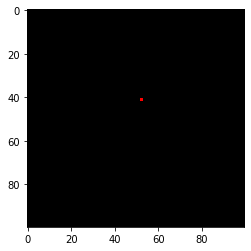

## Tinyrender-Lesson 0 画一个点

原文链接： https://github.com/ssloy/tinyrenderer/wiki/Lesson-0-getting-started


```python
import matplotlib.pyplot as plt
from PIL import Image
```


```python
def draw_point(image, position=(0,0), color=(255,255,255)):
    image.putpixel(position, color)
    return image
```


```python
image = Image.new("RGB",(100, 100),(0,0,0))
draw_point(image, (52,41), (255,0,0))
plt.imshow(image)
```



