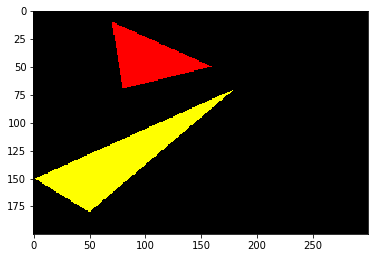
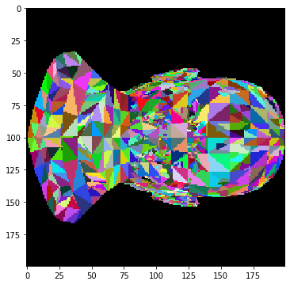
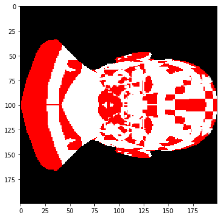

# Tinyrender-Lesson 2 Triangle rasterization and back face culling

原文：https://github.com/ssloy/tinyrenderer/wiki/Lesson-2-Triangle-rasterization-and-back-face-culling

在Lesson 1中已经可以通过划线的方式绘制三角形的边。那么如何绘制填充颜色的三角形呢？


```python
import matplotlib.pyplot as plt
from PIL import Image
import numpy as np

def draw_line(p0, p1, image, color):
    distance = abs(np.array(p0)-np.array(p1))
    # 确定距离大的一方，来确定采样步长
    maxIndex = 0 if distance[0] > distance[1] else 1
    minIndex = 1 - maxIndex

    # 计算采样步长
    step1 = 1 if p1[maxIndex] > p0[maxIndex] else -1
    step2 = 1 if p1[minIndex] > p0[minIndex] else -1
    
    # 计算另一方，一个采样步长对应的递增步长
    dy = abs((p1[minIndex] - p0[minIndex])/(p1[maxIndex] - p0[maxIndex]))
    
    b = p0[minIndex]
    error = 0
    for a in range(int(p0[maxIndex]), int(p1[maxIndex]) + step1, step1):
        if maxIndex == 0: # 说明xy顺序没有发生变化
            image.putpixel((int(a),int(b)), color)
        else:
            image.putpixel((int(b), int(a)), color)
        error = error + dy
        if error > 0.5:
            b = b + step2
            error = error - 1.
            
def draw_triangle(t0, t1, t2, image, color):
    draw_line(t0, t1, image, color)
    draw_line(t1, t2, image, color)
    draw_line(t2, t0, image, color)
    
t0 = [[10,70], [50,160], [70,80]]
t1 = [[180,50], [150, 1], [70, 180]]
t2 = [[180,150], [120,160], [130,180]]

image = Image.new("RGB", (200, 200), (0,0,0))
draw_triangle(t0[0], t0[1], t0[2], image, (255,0,0))
draw_triangle(t1[0], t1[1], t1[2], image, (255,255,255))
draw_triangle(t2[0], t2[1], t2[2], image, (0,255,0))

fig = plt.figure(figsize=(6,6))
ax = fig.add_subplot(111)
ax.imshow(image)
```

## 老派方法：扫线

1. 对点按照y轴坐标进行排序；
2. 从左往右，找到和三角形相交的两个点
3. 用一条线把两个点连起来

这个逻辑很简单，关键部分是求出左边的起点和右边的终点。

```python
def draw_triangle2(vertices, image, color):
    vertices = vertices[vertices[:,1].argsort()]
    diff_y1_y0 = vertices[1][1] - vertices[0][1] + 1
    diff_y2_y1 = vertices[2][1] - vertices[1][1] + 1
    diff_y2_y0 = vertices[2][1] - vertices[0][1] + 1
    for y in range(vertices[0][1], vertices[1][1]+1):
        ratio0 = (y - vertices[0][1])/diff_y1_y0
        ratio1 = (y - vertices[0][1])/diff_y2_y0
        p0 = vertices[0] * (1-ratio0) + vertices[1] * ratio0
        p1 = vertices[0] * (1-ratio1) + vertices[2] * ratio1
        draw_line([p0[0],y], [p1[0],y], image, color)
    for y in range(vertices[1][1], vertices[2][1]+1):
        ratio0 = (y - vertices[1][1])/diff_y2_y1
        ratio1 = (y - vertices[0][1])/diff_y2_y0
        p0 = vertices[1] * (1-ratio0) + vertices[2] * ratio0
        p1 = vertices[0] * (1-ratio1) + vertices[2] * ratio1
        draw_line([p0[0],y], [p1[0],y], image, color)

t0 = np.array([[10,70], [50,160], [70,80]])
t1 = np.array([[180,50], [150, 1], [70, 180]])
t2 = np.array([[180,150], [120,160], [130,180]])

image = Image.new("RGB", (200, 300), (0,0,0))
draw_triangle2(t0, image, (255,0,0))
draw_triangle2(t1, image, (255,255,255))
draw_triangle2(t2, image, (0,255,0))

fig = plt.figure(figsize=(6,6))
ax = fig.add_subplot(111)
ax.imshow(image)
```


## 利用重心坐标

利用重心坐标的实现，也可以参见本人另一篇文章：https://zhuanlan.zhihu.com/p/149057777

下面给出基于taichi的实现，taichi见：https://github.com/taichi-dev/taichi

```python
import taichi as ti

ti.init(arch=ti.cpu)

n = 200
pixels = ti.Vector(3, dt=ti.f32, shape=(n,n+100))

@ti.kernel
def draw_triangle(p0i:ti.ext_arr(), p1i:ti.ext_arr(), p2i:ti.ext_arr(), colori:ti.ext_arr(), n:ti.int64):
    for i, j in pixels:
        # 计算重心坐标
        for it in range(n):
            p0 = ti.Vector([p0i[it,0], p0i[it,1]])
            p1 = ti.Vector([p1i[it,0], p1i[it,1]])
            p2 = ti.Vector([p2i[it,0], p2i[it,1]])
            color = ti.Vector([colori[it,0], colori[it,1], colori[it,2]])
            mat = ti.Matrix.cols([p0-p2,p1-p2])
            matInv = mat.inverse()
            p = ti.Vector([i-p2[0],j-p2[1]])
            pp = matInv @ p
            if pp[0] > 0 and pp[1] > 0 and 1 - pp[0] - pp[1] > 0:
                pixels[i,j] = color
        
p0 = np.array([[10, 70],[180,50]])
p1 = np.array([[50,160],[150,1]])
p2 = np.array([[70, 80],[70,180]])

color = np.array([[255,0,0],[255,255,0]])
draw_triangle(p0, p1, p2, color, 2)

fig = plt.figure(figsize=(6,6))
ax = fig.add_subplot(111)
ax.imshow(pixels.to_numpy())

```




这里可能比较好奇，为啥得到的图像和之前的是反的？因为对于图像而言，(m,n),m指的是宽，n指的是高。对于数组(m,n)而言，m指的是行数，n指的是列数。这个可以自己试着调整下。

下面来看下利用这个绘制函数来绘制下https://github.com/ssloy/tinyrenderer/tree/master/obj/african_head 中的african_head.obj


```python
import taichi as ti

ti.init(arch=ti.cpu)

n = 200
pixels = ti.Vector(3, dt=ti.int32, shape=(n,n))

@ti.kernel
def draw_triangle(p0i:ti.ext_arr(), p1i:ti.ext_arr(), p2i:ti.ext_arr(), colori:ti.ext_arr(), n:ti.int64):
    for i, j in pixels:
        # 计算重心坐标
        for it in range(n):
            p0 = ti.Vector([p0i[it,0], p0i[it,1]])
            p1 = ti.Vector([p1i[it,0], p1i[it,1]])
            p2 = ti.Vector([p2i[it,0], p2i[it,1]])
            color = ti.Vector([colori[it,0], colori[it,1], colori[it,2]])
            mat = ti.Matrix.cols([p0-p2,p1-p2])
            matInv = mat.inverse()
            p = ti.Vector([i-p2[0],j-p2[1]])
            pp = matInv @ p
            if pp[0] > 0 and pp[1] > 0 and 1 - pp[0] - pp[1] > 0:
                pixels[i,j] = color

from vispy import io

verts, faces, normals, nothing = io.read_mesh("data/african_head.obj")

p0 = np.zeros([faces.shape[0], 2])
p1 = np.zeros([faces.shape[0], 2])
p2 = np.zeros([faces.shape[0], 2])
color = np.random.randint(0, 255, (faces.shape[0], 3))

for i in range(faces.shape[0]):
    p0[i] = (verts[faces[i,0]][:2] + 1) * n/2
    p1[i] = (verts[faces[i,1]][:2] + 1) * n/2
    p2[i] = (verts[faces[i,2]][:2] + 1) * n/2
    
draw_triangle(p0, p1, p2, color, faces.shape[0])

fig = plt.figure(figsize=(6,6))
ax = fig.add_subplot(111)
ax.imshow(pixels.to_numpy())
```



在原文中还引入了光照以及法向量，此处不进行考虑。仅对back face culling进行简单说明，三角形的三个点排序后可能是顺时针方向，也可能是逆时针方向，如果我们规定，逆时针方向为正面，那么顺时针方向的三角形就是背面，那么back face culling的意思就是不绘制顺时针方向的点。对上面的例子进行更改，如果逆时针方向，那么就是红色，如果是顺时针方向，那么就是白色。由于obj中的三角片面的顺序和正面反面无关，因此必然会得到不同颜色相交的现象。


```python
import taichi as ti

ti.init(arch=ti.cpu)

n = 200
pixels = ti.Vector(3, dt=ti.int32, shape=(n,n))

@ti.kernel
def draw_triangle(p0i:ti.ext_arr(), p1i:ti.ext_arr(), p2i:ti.ext_arr(), colori:ti.ext_arr(), n:ti.int64):
    for i, j in pixels:
        # 计算重心坐标
        for it in range(n):
            p0 = ti.Vector([p0i[it,0], p0i[it,1]])
            p1 = ti.Vector([p1i[it,0], p1i[it,1]])
            p2 = ti.Vector([p2i[it,0], p2i[it,1]])
            color = ti.Vector([colori[it,0], colori[it,1], colori[it,2]])
            mat = ti.Matrix.cols([p0-p2,p1-p2])
            matInv = mat.inverse()
            p = ti.Vector([i-p2[0],j-p2[1]])
            pp = matInv @ p
            if pp[0] > 0 and pp[1] > 0 and 1 - pp[0] - pp[1] > 0:
                pixels[i,j] = color

from vispy import io

verts, faces, normals, nothing = io.read_mesh("data/african_head.obj")

p0 = np.zeros([faces.shape[0], 2])
p1 = np.zeros([faces.shape[0], 2])
p2 = np.zeros([faces.shape[0], 2])
color = np.zeros([faces.shape[0], 3], dtype=np.int32)

for i in range(faces.shape[0]):
    p0[i] = (verts[faces[i,0]][:2] + 1) * n/2
    p1[i] = (verts[faces[i,1]][:2] + 1) * n/2
    p2[i] = (verts[faces[i,2]][:2] + 1) * n/2
    crossdir = np.cross((verts[faces[i,1]] - verts[faces[i,0]]),(verts[faces[i,2]] - verts[faces[i,1]]))
    # 不考虑坐标变换
    if crossdir[2] > 0:
        color[i] = np.array([255,0,0], dtype=np.int32)
    else:
        color[i] = np.array([255,255,255], dtype=np.int32)
    
draw_triangle(p0, p1, p2, color, faces.shape[0])

fig = plt.figure(figsize=(6,6))
ax = fig.add_subplot(111)
ax.imshow(pixels.to_numpy())
```


