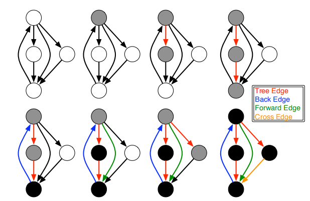

# Generic Programming and Graph

链接：http://ecee.colorado.edu/~siek/boostcon2010bgl.pdf

原文中还介绍了一点boost graph library相关的内容。由于对于boost graph library的介绍比较少。这里仅覆盖Generic Programming和Generic Graph Demo。

## Introduction to Generic Programming

### Why using generic programming

如果用基于面向对象的方式设计算法和数据结构，那么类似如下：

```c++
struct vector {
    void merge(const vector& a, const vector& b) { ... }
    void reverse() { .. }
    void sort() { ... }
};

struct list {
    void merge(const list& a, const list& b) { ... }
    void reverse() { .. }
    void sort() { ... }
}
```

使用上面这种方式进行实现的话，如果有M种算法，N种数据结构，那么就需要写O(MxN)的代码量。

如果采用泛型编程呢？

```c++
template<class InputIter1, class InputIter2, class OutputIter>
OutputIter merge(InputIter1 first1, InputIter last1, InputIter2 first2, InputIter2 last2, OutputIter result);

template<class BidirectionalIter>
void reverse(BidirectionalIter first, BidirectionalIter last);

template<class RandomAccessIter>
void sort(RandomAccessIter first, RandomAccessIter last);

struct vector {
    struct iterator;
    iterator begin();
    iterator end();
};

struct list {
    struct iterator;
    iterator begin();
    iterator end();
};
```

这样只要实现O(M+N)的代码量。

### Type Requirements and Concepts

那么上面实现的模板函数可以匹配哪些类型呢？

```c++
int main()
{
    vector<int> v;
    sort(v.begin(), v.end()); // ok
    
    list<int> l;
    sort(l.begin(), l.end()); // error!
}
```

具体错误示例如下：

```c++
stl algo.h: In function ’void std::sort( _RandomAccessIterator,
                                         _RandomAccessIterator)
[with _RandomAccessIterator = std::_List_iterator<int>]’:
sortterror.cpp:6: instantiated from here
stl algo.h:2570: error: no match for ’operator--’ in ’last - first’
```

为了说明模板会有特定的需求，这里引出了“**Concepts**”的概念：Concepts就是各种需求的集合。再引入一个概念，叫做“**Models**”，用来表示基于**Concepts**的具体实现。这样，对于算法：

```c++
template<class Iter>
void sort(Iter first, Iter last);
```

类型的需求为：

- Iter需要是**Random Access Iterator**；
- Iter类型的值，支持**Less Than Comparable**

这里就提出了两个概念：**随机访问迭代器**，支持自增，自减，支持任意步长的前后移动，和**less比较**。

而在通常情况下一个概念会包括以下类型的需求：

- 合法表达式；
- 相关联的类型，这些类型的需求；
- 精简；？？
- 对操作提供有效保证；
- 操作相关的语义需求（前置，后置条件，不变性等）；

#### 关联类型举例

`inputIterator`概念，含有`value_type`, `difference_type`两个关联类型；支持的有效操作为`*i`，`++i`。

对应一个model如下：

```c++
template<class T> struct list_iterator {
    typedef T value_type;
    typedef ptrdiff_t difference_type;
    T& operator*() const { return current->data; }
    list_iterator& operator++() { current = current->next; return *this; }
}
```

在算法实现中对关联类型的访问：

```c++
template<typename InputIterator1, typename InputIterator2>
void iter_swap(InputIterator1 a, InputIterator2 b)
{
    typedef typename InputIterator1::value_type T;
    T tmp = *a;
    *a = *b;
    *b = tmp;
}
```

但是这样简单的实现会有一个问题，如果类型是内置类型，如指针，那么就没法使用这个算法了，为了解决这个问题，就引入了traits class。

```c++
// Default version for class type
template <class Iter> struct iterator_traits {
    typedef typename Iter::value_type value_type;
    typedef typename Iter::difference_type difference_type;
}

// Partial specialization for pointer types
template <class T> struct iterator_traits<T*> {
    typedef T value_type;
    typedef ptrdiff_t difference_type;
}

template<typename InputIterator1, typename InputIterator2>
void iter_swap(InputIterator1 a, InputIterator2 b)
{
    typedef typename iterator_traits<InputIterator1>::value_type T;
    T tmp = *a;    *a = *b;    *b = tmp;
}
```

### 小结

- 使用泛型编程，在设计算法和数据结构的时候，可以将代码量从O(MxN)减少到O(M+N)；
- 创建概念，用来描述和组织模板对于类型的需求；
- 创建traits 类，用来访问概念中涉及到的关联的类型（associated types）；
- 满足概念具体需求的类型，被称为model；
- 最小化模板上的需求以最大限度地提高重用的可能性；

## Graphs

下面会以图算法的实现为例，将泛型编程应用起来。

### 问题描述以及伪代码实现

**问题**：如何找到迷宫的出路？

**解决方案**：深度优先查找，对走过的路都做上标记。

**伪代码**：

```
DFS(G, u)
  if u is the exit
  	return success
  mark[u] <- BLACK
  for ecah v in Adjacent(u)
    if mark[v] == WHITE
      if DFS(G, v) == success
        return success
  return failure
```

### 如何实现generic深度优先查找算法

#### 需求

- 需要能够对点的值进行访问；
- 需要能够访问给定顶点的邻接点；
- 需要能够对点的颜色进行设置（黑色或白色）；（对于颜色可以进一步修正，没有访问过的用白色，访问过但不知道走得通走不通，用灰色，访问过走不通的用黑色，这样有个好处，当遍历的时候如果遇到灰色，那么就说明走了一圈，回到原处了）
- 需要一种方法在搜索期间执行自定义操作，例如检查是否成功和终止；

针对这些需求可以引申出不同的概念。

#### 概念: 邻接图（Adjacency Graph）

由**需求：需要能够访问给定顶点的邻接点**引出。

定义接口用来定义访问图中邻接顶点。

相关联的类型有（通过graph_traits访问）：

- vertex_descriptor
- adjacency_iterator：必须是多通输入迭代器？，他的value_type必须是vertex_descriptor

有效表达式有：

- adjacent_vertices(v, g) : pair<adjacency_iterator>, 其中v是graph，g是vertex_descriptor

#### 概念：属性map（Property Map）

由**需求：需要能够对点的颜色进行设置（黑色或白色）**引出。

有两个子概念：

- Readable Property Map。
  - 相关的类型有(通过property_traits访问)：
    - key_type
    - value_type
    - reference 
  - 相关的表达式有：
    - get(pmap, k) : reference
- Writable Property Map.
  - 相关类型和Readable Property Map一致；
  - 相关表达式：
    - put(pmap, k, v) : void

#### 概念：DFS Visitor

由**需求：需要一种方法在搜索期间执行自定义操作，例如检查是否成功和终止；**引出。

相关的表达式为：

- vis.initialize_vertex(v,g) : 开始search前初始化；即，在初始化需要执行的操作；
- vis.discover_vertex(v,g) : 第一次选中一个顶点；即，找到第一个点的时候需要执行的操作
- vis.examine_edge(e,g) : 在发现源顶点之后，但在目标之前；即，从第源点到目标点行进的过程中需要执行的操作；
- vis.tree_edge(e, g): 当edge添加到DFS-tree；即，当要继续search的时候需要执行的操作；
- vis.back_edge(e,g): 当目标顶点是DFS树中源顶点的祖先时;即，当发现下一个顶点是之前经过的顶点你的时候，需要执行的操作；
- vis.forward_or_cross_edge(e, g): 当源和目标不是彼此的后代；对于遇到之前走不通的顶点的时候需要执行的操作；

上面的各种表达式，可以理解成不同的时期，需要执行的特定的操作。各个时期的示意图如下：



#### 概念：关联图

定义用来访问图中一个顶点的出边。

相关的类型有(通过graph_traits访问)：

- vertex_descriptor:
- edge_descriptor
- out_edge_iterator：value_type必须是edge_descriptor

相关的操作有：

- out_edges(v,g) : pair<out_edge_iterator>
- source(e,g): vertex_descriptor
- target(e,g): vertex_descriptor

#### 模板函数实现

```c++
// Graph 是满足Incidence Graph概念的model
// Map   是Readable和Writable Property Map的model，
//       其key_type是Graph的vertex_descriptor, value_type是bool
// Visitor是概念DFS Visitor的model。Visitor的vertex和edge的类型和Graph一致
template<class Graph, class Map, class Visitor>
void depth_first_visit(const Graph& G, 
                       typename graph_traits<Graph>::vertex_descriptor u,
                       Map color,
                       Visitor vis)
{
    typedef typename graph_traits<Graph>::vertex_descriptor vertex;
    typedef typename graph_traits<Graph>::edge_descriptor edge;
    put(color, u, gray); vis.discover_vertex(u,G);
    for (edge e : out_edges(u, G)) {
        vertex v = target(e, G); vis.examine_edge(e, G);
        if (get(color, v) == white) {
            vis.tree_edge(e, G);
            depth_first_visit(G, v, color, vis);
        } else if (get(color, v) == gray) vis.back_edge(e, G);
        else vis.forward_or_cross_edge(e, G);
    }
    put(color, u, black);
}

```

