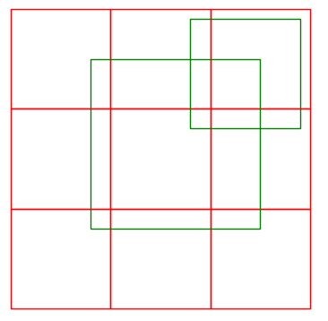

# CGAL - user manual - Intersecting Sequences of dD Iso-oriented Boxes   

See: https://doc.cgal.org/latest/Box_intersection_d/index.html

## 1 简介

当几何对象变得复杂的时候，像相交计算，距离计算等这些简单的问题求解需要很高的代价，比如，三维三角形和多面体表面网格的相交计算。实际应用中，这些几何计算会变慢。对求解优化的常见方式是对每个几何图元，给出沿着轴线的包围盒，对算法进行适当修改应用于包围盒相关计算中，仅在相交的包围盒上面，执行复杂表面的相关计算。


## 2 定义

box有两种类型，一种是半开区间的，定义为：$\{[lo_i,hi_i)|0\le i\lt d\}$，一种是闭区间的$\{[lo_i,hi_i]|0\le i\lt d\}$.需要注意的是闭区间的box支持宽度为0，他们可以在边界上相交。

此外，一个box有唯一的id。这样即使boxes的坐标完全相同，也能够得到一致的排序。（比如boxes A，B两个的坐标完全相同，那么在排序的时候，有可能第一次A在B的前面，打乱顺序第二次排序的时候有可能B在A的前面，而通过id，那么能够保证这个顺序一定是不变的。)同时也能够保证，相同的相交对只会出现一次。

box相交算法有两种风格：第一种是对单个序列中的盒子的所有对进行相交计算，比如，自相交测试；第二种是对两个序列中的盒子进行相交计算。

## 3 软件设计

接口设计如下：

```c++
#include <CGAL/box_intersection_d.h>
template< class RandomAccessIterator, class Callback >
void box_intersection_d(RandomAccessIterator begin,          // 迭代器
                        RandomAccessIterator end,
                        Callback callback);                  // 回调函数
template< class RandomAccessIterator1, 
          class RandomAccessIterator2, 
          class Callback >
void box_intersection_d(RandomAccessIterator1 begin1, RandomAccessIterator1 end1,
                        RandomAccessIterator2 begin2, RandomAccessIterator2 end2,
                        Callback callback);
```

还有其他额外的参数，如，`cutoff`，用于调整性能折中的参数，`topology`用来确定是开区间的，还是闭区间的。

在算法中会对boxes进行重排。支持对象拷贝，和指针拷贝两种方式。

详见原文。

## 4 Examples

对其中的部分示例进行摘录介绍。

### 4.1 minimal Example

九宫格示例（如下图）：



```c++
#include <CGAL/box_intersection_d.h>
#include <CGAL/Bbox_2.h>
#include <iostream>

typedef CGAL::Box_intersection_d::Box_d<double, 2> Box;
typedef CGAL::Bbox_2 Bbox;

Box boxes[9] = { Bbox(0,0,1,1), Bbox(1,0,2,1), Bbox(2,0,3,1), // low
                 Bbox(0,1,1,2), Bbox(1,1,2,2), Bbox(2,1,3,2), // middle
                 Bbox(0,2,1,3), Bbox(1,2,2,3), Bbox(2,2,3,3) };// upper
// 2 selected boxes as query; center and upper right
Box query[2] = { Bbox(0.8,0.8,2.5,2.5), Bbox(1.8,1.8,2.9,2.9) };

void callback(const Box& a, const Box& b) {
    std::cout << "box " << a.id() << " intersects box " << b.id() << std::endl;
}

int main()
{
    CGAL::box_intersection_d(boxes, boxes + 9, query, query + 2, callback);
    return 0;
}
```

### 4.2 使用自定义box

由于CGAL的设计基于concept，参见：**TODO：链接**。可以很方便的进行自定义扩展。

```c++
Concept BoxIntersectionBox_d
{
    typedef unknow_type NT;
    typedef unknow_type ID;
    static int dimension();
    
    ID id() const;
    NT min_coord(int d) const;
    NT max_coord(int d) const;
};
```

在自定义box的时候满足上面的concept即可，如下：

```c++
#include <CGAL/box_intersection_d.h>
#include <vector>
#include <algorithm>
#include <iterator>
#include <cassert>

struct Box {
    typedef int            NT;
    typedef std::ptrdiff_t ID;
    int lo[2], hi[2];
    Box(int lo0, int lo1, int hi0, int hi1) : lo{ lo0, lo1 }, hi{ hi0, hi1 } {}
    static int dimension() { return 2; }
    NT min_coord(int dim) const { return lo[dim]; }
    NT max_coord(int dim) const { return hi[dim]; }
    ID id() const { return (ID)(this); }
};
```

完整示例见原文。

###    4.3 Example for Point Proximity Search with a Custom Traits Class

除了4.2中介绍的`BoxIntersectionBox_d`概念之外，还提供了`BoxIntersectionTraits_d`用来自定义扩展。该概念如下：

```c++
Concept BoxIntersectionTraits_d
{
    typedef unknow_type Box_parameter;      // 比BoxIntersectionBox_d多了这个类型
    typedef unknow_type NT;
    typedef unknow_type ID;
    static int dimension();
    
    ID id(Box_parameter box) const;
    NT min_coord(Box_parameter box, int d) const;
    NT max_coord(Box_parameter box, int d) const;
};
```

对该概念的实现如下：

```c++
#include <CGAL/Simple_cartesian.h>
#include <CGAL/box_intersection_d.h>
#include <vector>
#include <fstream>
typedef CGAL::Simple_cartesian<float>             Kernel;
typedef Kernel::Point_3                           Point_3;
std::vector<Point_3>  points;
std::vector<Point_3*> boxes;     // boxes are just pointers to points
const float           eps = 0.1f; // finds point pairs of distance < 2*eps

// Boxes are just pointers to 3d points. The traits class adds the
// +- eps size to each interval around the point, effectively building
// on the fly a box of size 2*eps centered at the point.
struct Traits {
    typedef float          NT;
    typedef Point_3*       Box_parameter;
    typedef std::ptrdiff_t ID;
    static int   dimension() { return 3; }
    static float coord( Box_parameter b, int d) {
        return (d == 0) ? b->x() : ((d == 1) ? b->y() : b->z());
    }
    static float min_coord( Box_parameter b, int d) { return coord(b,d)-eps;}
    static float max_coord( Box_parameter b, int d) { return coord(b,d)+eps;}
    // id-function using address of current box,
    // requires to work with pointers to boxes later
    static std::ptrdiff_t id(Box_parameter b) { return (std::ptrdiff_t)(b); }
};
```

完整示例见原文。