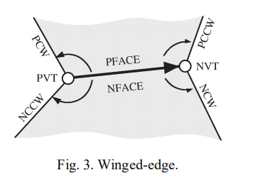
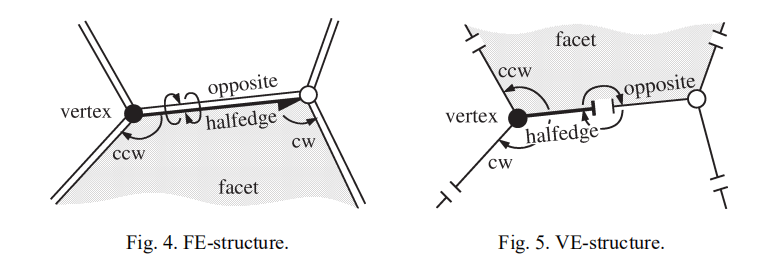
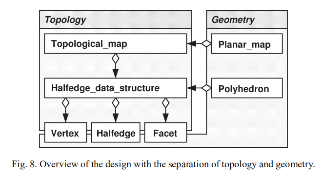
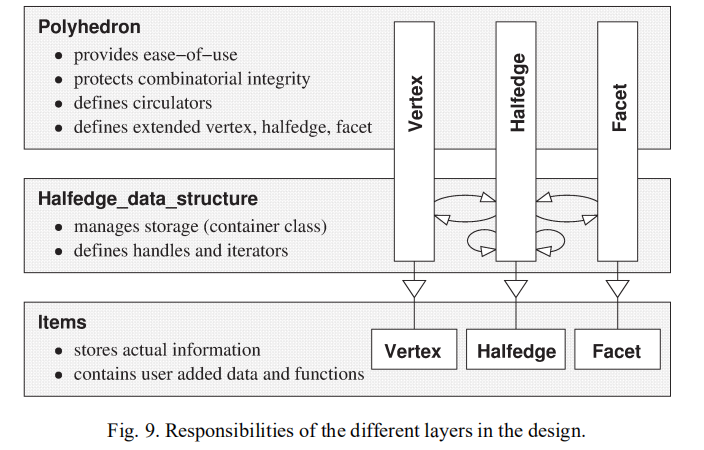

# CGAL - read 《Using generic programming for designing a data structure for polyhedral surfaces》

## 多边形表面

文章中会出现manifold，流形，想要认识是啥东西，可以参见：[流形（Manifold）初步](https://blog.csdn.net/wangxiaojun911/article/details/17076465)

那么接着，2-manifold又是啥东西？在上面的流形介绍的时候提到，*连续的变换最后都能变成一样的两个物体，称为同胚（Homeomorphism）*，而2-manifold指的就是物体如果经过连续变换后成为一个平面或闭合的半平面，那么这个物体就是2-manifold的。参见：https://encyclopediaofmath.org/index.php/Two-dimensional_manifold。感觉还是不是很理解，先这样吧。

文中的设计会有以下的优点：

- 编译时完成；得益于c++泛型编程；
- 内存只有在实际使用的时候才会分配；
- 没有牺牲数据结构的易用性；

文中给出的一些定义如下：

**定义1**：**structural complex**是带映射关系的三个不相交集合的并集，$C = V \cup E \cup F$。其中V是顶点集合，E是边的集合，F是面片的集合。C中的映射关系是对称的。相同集合中的元素（V,E,F各自集合中的元素）没有映射关系。如果$v \in V$和$e \in E$有关联，e和$f \in F$有关联，那么v和f有关联。

**定义2**：**polyhedral complex**是带有四个额外条件的**structural complex**：
(1) 每条边和两个顶点关联；
(2) 每条边属于两个面；
(3) 对于相关联的v，f，恰好只有两条边和v，f同时关联；
(4) 每个顶点和每个面，至少与其他的一个元素关联；

**定义3**：**boundary representation of a polyhedron**(多面体的边界表示)是orientable polyhedral complex？？，每个顶点或每个面片的neighborhood都是单个环，满足$V \rightarrow R^3$。以下额外的条件必须满足：
(1) 每个面邻域的图像是简单平面多边形的边界。
(2)$C = V \cup E \cup F$所有的元素都是两两不相交的。

不明白**Orientable**是什么意思？？

通过**定义2**中的3和2可以得出，一个顶点的**neighborhood**会形成一个环，而且是面，边互相间隔形成。一个**polyhedral complex**是2-manifold，当且仅当，每个顶点的neighborhood只有一个环。

根据**boundary representation**定义的表面是 orientable 2-manifold（这货又出现了。。。）它具有一些有用的特性，如：两个顶点的邻域最多有一条边和两个面，边图和顶点图在曲面的每个连通分量内连接（？？），每个面在其边界上至少有三条边，最小的可能构型是四面体。

到目前为止，定义的都是闭合的曲面，这个定义可以扩展为带边界的曲面。需要将**条件(2)**放松为，允许边和一个面关联，此时这条边就被称为**边界边**。这样会导致**定义3**的改动：顶点的领域可以分解为单个圆环或边界边沿着边界边形成的open paths的集合。此时最小的构型是三角形。

## 多边形表面的表示方式

### indexed facet set

indexed facet set简单的来讲就是一些列的点，然后紧跟着，一系列的面。每个面由点的索引组成。对于显示而言，这样的数据结构是很方便的。但并不能表示面片上的洞。

indexed facet set使用场景的一个典型的例子是off文件格式，详见：https://www.cnblogs.com/chamie/p/9204306.html

### Winged-edge data structure



Winged-edge存储的数据有：

- 待方向的边A；
- 边A的两个顶点（PVT，NVT）；
- 边A相邻的两个面（PFACE，NFACE）；
- 四条共享面和顶点的边（PCW，NCCW，NCW，PCCW）

遍历计算中效率低下的大小写区分是由于指向边的指针没有对当前使用的方向进行编码。

### Halfedge data structure

为了解决winged-edge数据结构：“遍历计算中效率低下的大小写区分是由于指向边的指针没有对当前使用的方向进行编码”的问题，引入了半边数据结构。半边数据结构有两种分割方式，一种是分割成两半，分别属于不同的面片；另一种是分割成两半，分别属于不同的顶点。如下图所示：



半边数据结构对于边、面、顶点的访问非常方便。

### Quad-edge data structure

*可以说没看明白么*

## 多面体表面的设计目标

多面体可以看作是一个容器类，它管理多面体表面的顶点、半边和面，并保持它们的组合结构。我们的设计考虑了以下设计问题：

1. 顶点，边，面的实际存储组织方式会对空间和运行性能产生影响。双向list的表示方式，允许随机插入和删除，同时提供双向的迭代器访问所有的元素。更节省空间的存储方式是使用STL的vector，只能快速的移除vector末尾的元素，但是提供了随机访问的迭代器。其他实现方式也是可能的，例如管理内存块或在堆上简单地分配内存而不使用任何迭代器；
2. 必要的关联关系可能取决于应用程序。为了保证半边数据结构的连接关系，每个半边至少需要`next`和`opposite`两个指针。其他的关系存储变量是可选的。可以通过这两个指针；
3. 需要能够让用户针对不同的类型添加额外的信息，如，面片的颜色。在添加额外信息的时候，不应该需要用户去定义新的type；
4. 数据结构需要提供方便使用的高度抽象的接口；
5. 连接部件和包含关系的管理，如，面片内部和外部边界，shells的嵌套关系，被视为一个独立的功能，可以单独添加，例如，在其自己的层中并具有自己的灵活性；
6. 为了更加方便的遍历顶点周围的边，以及面片周围的边，提出了和迭代器类似的概念，circulator；
7. STL容器的接口基于迭代器。对于多面体曲面，从用户的角度来看，元素在多面体中的存储顺序并不总是很好地定义。这里我们回到handles的概念上，handles是表示迭代器一部分的项，而忽略了遍历功能。特别是，迭代器或循环器的任何模型都是句柄的模型。句柄也称为普通迭代器。

## 设计概览



`Halfedge_data_structure`用来管理vertex，halfedge，facet以及拓扑关系。`Topological_map`往其中添加了对面片洞管理的逻辑，可以获取面片的内部边和外部边。`Polyhedron`添加了对`Halfedge_data_structure`的操作。`Planar_map`基于拓扑图？？？




**Items**对实际内容进行存储，同时带有一些变量读写访问的函数。halfedges提供了对next和opposite边引用的访问。其他的还可以带些可选参数。此外，items还可以针对任意属性和成员函数进行扩展（采用继承的方式）。

**Halfedge_data_structure**负责对items的管理。内部定义了iterators和handles。提供了对items插入，删除，遍历的接口。

**Polyhedron**提供了更易用的，更高抽象级别的接口。

## 使用c++模板进行实现

关键点是某个item类型（如，vertex）并不知道相关联的items（如halfedge类型），只知道该类型的占位符。所有的formal placeholders都放到了一个模板参数`Refs`中。vertex如下：

```c++
template <class Refs>
struct Vertex {
    typedef typename Refs::Halfedge_handle Halfedge_handle;
    Halfedge_handle halfedge() { return h; }
    void set_halfedge(Halfedge_handle g) { h = g; }
private:
    Halfedge_handle h;
};
```

其他的item类型实现类似。halfedge data structure，被items类型参数化。不包含facet类型的实现示例如下：

```c++
template< template <class> Vertex, template <class> Halfedge>
struct HalfedgeDS {
    typedef HalfedgeDS<Vertex, Halfedge> Self;
    typedef Vertex<Self>                 V;
    typedef Halfedge<Self>               H;
    typedef list<V>                      Vlist;
    typedef list<H>                      Hlist;
    typedef typename Vlist::iterator     Vertex_handle;
    typedef typename Hlist::iterator     Halfedge_handle;
    // ...
};
```

剩下的内容中，主要摘录了一些片段代码，主要用来说明如何使用c++模板。并没有详细到Fig 9中类型的构建。