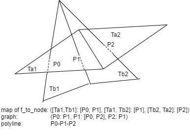

# CGAL - SourceCode - Intersection_of_triangle_meshes 源码阅读

`CGAL\Polygon_mesh_processing\internal\Corefinement\intersection_impl.h`

## 基本原理

该functor用来计算三角形网格的两两相交。相交结果是polylines（多线段）。该算法的基本步骤如下：

每个三角形网格中，我们从边中提取出segments集合，从面中，提取出三角形集合。

### 第一步：利用Box_intersection_d粗筛

我们使用Box_intersection_d过滤出一个三角网格segments和另一个三角网格相交的区域。

### 第二步：求交

从这个过滤的集合中，每个(segment，triangle)对，我们查看相交类型。

1) segment和三角形内部相交：我们计算出相交的交点，对于每个与线段相关的面，我们保存交点和相交三角形的面的关系；

2) segment和三角形的边相交：计算相交的交点，保留这条边相关的三角形；

3) segment和三角形顶点相交：执行和2)相同的操作；

In case a segment belong to the triangle, we repeat the same procedure for each segment incident to this endpoint.？？？

注意给定一对（段，三角形）=（S，T），如果S属于T所在的平面，满足下面情况的话，我们不做任何事情：

- 没有三角形T'包含S使得T和T'共面

- 至少有一个三角形包含S

### 特殊步骤：共面处理

共面的三角形被过滤出来单独处理。

## 具体实现

### Operator()全览

```c++
  template <class OutputIterator>
  OutputIterator operator()(OutputIterator output,
                            bool throw_on_self_intersection,
                            bool build_polylines)
  {
    CGAL_assertion(!doing_autorefinement);

    const TriangleMesh& tm1=nodes.tm1;       // 第一个三角网格
    const TriangleMesh& tm2=nodes.tm2;       // 第二个三角网格
    const VertexPointMap& vpm1=nodes.vpm1;   // 第一个vertex point map
    const VertexPointMap& vpm2=nodes.vpm2;   // 第二个vertex point map

    // 第一步：利用Box_intersection_d过滤出有交集的部分
    // filter_intersections介绍详细见后面
    filter_intersections(tm1, tm2, vpm1, vpm2, throw_on_self_intersection);
    filter_intersections(tm2, tm1, vpm2, vpm1, throw_on_self_intersection);

    Node_id current_node((std::numeric_limits<Node_id>::max)());
    CGAL_assertion(current_node+1==0);

    // 特殊步骤：处理共面的情况
    #ifndef DO_NOT_HANDLE_COPLANAR_FACES
    //first handle coplanar triangles
    if (&tm1<&tm2)
      compute_intersection_of_coplanar_faces(current_node, tm1, tm2, vpm1, vpm2);
    else
      compute_intersection_of_coplanar_faces(current_node, tm2, tm1, vpm2, vpm1);
    visitor.set_number_of_intersection_points_from_coplanar_faces(current_node+1);
    if (!coplanar_faces.empty())
      visitor.input_have_coplanar_faces();
    #endif // not DO_NOT_HANDLE_COPLANAR_FACES

    // 第二步：求交
    //compute intersection points of segments and triangles.
    //build the nodes of the graph and connectivity infos
    Edge_to_faces& tm1_edge_to_tm2_faces = (&tm1<&tm2)
                                         ? stm_edge_to_ltm_faces
                                         : ltm_edge_to_stm_faces;
    Edge_to_faces& tm2_edge_to_tm1_faces = (&tm1>&tm2)
                                         ? stm_edge_to_ltm_faces
                                         : ltm_edge_to_stm_faces;
    // 计算交点，详细见后文
    compute_intersection_points(tm1_edge_to_tm2_faces, tm1, tm2, vpm1, vpm2, current_node);
    compute_intersection_points(tm2_edge_to_tm1_faces, tm2, tm1, vpm2, vpm1, current_node);
    if (!build_polylines){
      visitor.finalize(nodes,tm1,tm2,vpm1,vpm2);
      return output;
    }
    //remove duplicated intersecting edges:
    //  In case two faces are incident along an intersection edge coplanar
    //  in a face of another polyhedron (and one extremity inside the face),
    //  the intersection will be reported twice. We kept track
    //  (check_coplanar_edge(s)) of this so that,
    //  we can remove one intersecting edge out of the two
    remove_duplicated_intersecting_edges();

    // 构建多线段，详细见后文
    //using the graph approach (at some point we know all
    // connections between intersection points)
    construct_polylines(output);

    visitor.finalize(nodes,tm1,tm2,vpm1,vpm2);
    return output;
  }

```

### filter_intersections全览

box_intersection_d使用的介绍可以参见：**TODO：添加链接地址**

```c++
void filter_intersections(const TriangleMesh& tm_f,
                          const TriangleMesh& tm_e,
                          const VertexPointMap& vpm_f,
                          const VertexPointMap& vpm_e,
                          bool throw_on_self_intersection)
{
    std::vector<Box> face_boxes, edge_boxes;
    // 使用指针可以提高box_intersection_d速度
    std::vector<Box*> face_boxes_ptr, edge_boxes_ptr;

    // 遍历获取tm_f面片的box
    face_boxes.reserve(num_faces(tm_f));
    face_boxes_ptr.reserve(num_faces(tm_f));
    BOOST_FOREACH(face_descriptor fd, faces(tm_f))
    {
      halfedge_descriptor h=halfedge(fd,tm_f);
      face_boxes.push_back( Box(
        get(vpm_f,source(h,tm_f)).bbox() +
        get(vpm_f,target(h,tm_f)).bbox() +
        get(vpm_f,target(next(h,tm_f),tm_f)).bbox(),
        h ) );
      face_boxes_ptr.push_back( &face_boxes.back() );
    }

    // 遍历获取tm_e边的box
    edge_boxes.reserve(num_edges(tm_e));
    edge_boxes_ptr.reserve(num_edges(tm_e));
    BOOST_FOREACH(edge_descriptor ed, edges(tm_e))
    {
      halfedge_descriptor h=halfedge(ed,tm_e);
      edge_boxes.push_back( Box(
        get(vpm_e,source(h,tm_e)).bbox() +
        get(vpm_e,target(h,tm_e)).bbox(),
        h ) );
      edge_boxes_ptr.push_back( &edge_boxes.back() );
    }

    /// \todo experiments different cutoff values
    std::ptrdiff_t cutoff = 2 * std::ptrdiff_t(
        std::sqrt(face_boxes.size()+edge_boxes.size()) );

    Edge_to_faces& edge_to_faces = &tm_e < &tm_f
                                 ? stm_edge_to_ltm_faces   // 较小地址的网格的边和较大地址的网格面组成的map
                                 : ltm_edge_to_stm_faces;  // 较大地址的网格的边和较小地址的网格面组成的map

    #ifdef DO_NOT_HANDLE_COPLANAR_FACES
    typedef Collect_face_bbox_per_edge_bbox<TriangleMesh, Edge_to_faces>
      Callback;
    Callback callback(tm_f, tm_e, edge_to_faces);
    #else
    typedef Collect_face_bbox_per_edge_bbox_with_coplanar_handling<
      TriangleMesh, VertexPointMap, Edge_to_faces, Coplanar_face_set>
     Callback;
    Callback  callback(tm_f, tm_e, vpm_f, vpm_e, edge_to_faces, coplanar_faces);
    #endif
    //using pointers in box_intersection_d is about 10% faster
    if (throw_on_self_intersection){
        Callback_with_self_intersection_report<TriangleMesh, Callback> callback_si(callback);
        CGAL::box_intersection_d( face_boxes_ptr.begin(), face_boxes_ptr.end(),
                                  edge_boxes_ptr.begin(), edge_boxes_ptr.end(),
                                  callback_si, cutoff );
        if (callback_si.self_intersections_found())
         throw Self_intersection_exception();
    }
    else
        CGAL::box_intersection_d( face_boxes_ptr.begin(), face_boxes_ptr.end(),
                              edge_boxes_ptr.begin(), edge_boxes_ptr.end(),
                              callback, cutoff );
}
```

该函数计算一个网格的三角面的box和另一个网格边的box的相交。并利用回调函数对相交的box进行进一步的处理。接着就需要看一下回调函数做了什么事情。此处先假设不做共面处理，自相交不抛出异常。那么只需要`Collect_face_bbox_per_edge_bbox`的实现即可。

### Collect_face_bbox_per_edge_bbox

代码位于：`CGAL\Polygon_mesh_processing\internal\Corefinement\intersection_callbacks.h`

```c++
template<class TriangleMesh, class EdgeToFaces>
class Collect_face_bbox_per_edge_bbox {
protected:
  const TriangleMesh& tm_faces;
  const TriangleMesh& tm_edges;
  EdgeToFaces& edge_to_faces;

  typedef boost::graph_traits<TriangleMesh> Graph_traits;
  typedef typename Graph_traits::face_descriptor face_descriptor;
  typedef typename Graph_traits::halfedge_descriptor halfedge_descriptor;
  typedef typename CGAL::Box_intersection_d::Box_with_info_d<double, 3, halfedge_descriptor> Box;

public:
  Collect_face_bbox_per_edge_bbox(
    const TriangleMesh& tm_faces,
    const TriangleMesh& tm_edges,
    EdgeToFaces& edge_to_faces)
  : tm_faces(tm_faces)
  , tm_edges(tm_edges)
  , edge_to_faces(edge_to_faces)
  {}

  // 记录相交的半边和面片的关系
  void operator()( const Box& face_box, const Box& edge_box) const
  {
    halfedge_descriptor fh = face_box.info();
    halfedge_descriptor eh = edge_box.info();

    edge_to_faces[eh].insert(face(fh, tm_faces));
  }

  void operator()( const Box* face_box_ptr, const Box* edge_box_ptr) const
  {
    operator()(*face_box_ptr, *edge_box_ptr);
  }
};

```

执行完之后就得到了相交的边和面的对应关系了。接下来执行交点计算。

### compute_intersection_points

```c++
  void compute_intersection_points(Edge_to_faces& tm1_edge_to_tm2_faces,
                                   const TriangleMesh& tm1,
                                   const TriangleMesh& tm2,
                                   const VertexPointMap& vpm1,
                                   const VertexPointMap& vpm2,
                                   Node_id& current_node)
  {
    // tuple<相交类型，相交面上的halfedge，p点是否在面上，q点是否在面上
    typedef cpp11::tuple<Intersection_type, halfedge_descriptor, bool,bool>  Inter_type;


    for(typename Edge_to_faces::iterator it=tm1_edge_to_tm2_faces.begin();
                                         it!=tm1_edge_to_tm2_faces.end();++it)
    {
      edge_descriptor e_1=it->first;
      halfedge_descriptor h_1=halfedge(e_1,tm1);
      Face_set& fset=it->second;
      while (!fset.empty()){
        face_descriptor f_2=*fset.begin();

        // 计算相交类型，Intersection_type的类型有：
        // EMPTY: 不相交
        // ON_FACE：交点在三角面上
        // ON_EDGE：交点在边上
        // ON_VERTEX: 交点在顶点上
        Inter_type res=intersection_type(h_1,f_2,tm1,tm2,vpm1,vpm2);
        Intersection_type type=cpp11::get<0>(res);

        // 获取所有相关的边，
        // 如果边穿过面，那么就是这条边;
        // 如果边的一个点在面上，那么就是这个点相关的所有的边；
    //handle degenerate case: one extremity of edge belong to f_2
        std::vector<halfedge_descriptor> all_edges;
        if ( cpp11::get<3>(res) ) // is edge target in triangle plane
          std::copy(halfedges_around_target(h_1,tm1).first,
                    halfedges_around_target(h_1,tm1).second,
                    std::back_inserter(all_edges));
        else{
          if ( cpp11::get<2>(res) ) // is edge source in triangle plane
              std::copy(halfedges_around_source(h_1,tm1).first,
                        halfedges_around_source(h_1,tm1).second,
                        std::back_inserter(all_edges));
          else
            all_edges.push_back(h_1);
        }

        CGAL_precondition(all_edges[0]==h_1 || all_edges[0]==opposite(h_1,tm1));

        // #ifdef USE_DETECTION_MULTIPLE_DEFINED_EDGES
        // check_coplanar_edges(cpp11::next(all_edges.begin()),
        //                      all_edges.end(),CGAL::cpp11::get<1>(res),type);
        // #endif

        typename std::vector<halfedge_descriptor>::iterator it_edge=all_edges.begin();
        switch(type){
          case COPLANAR_TRIANGLES:
            #ifndef DO_NOT_HANDLE_COPLANAR_FACES
            assert(!"COPLANAR_TRIANGLES : this point should never be reached!");
            #else
            //nothing needs to be done, cf. comments at the beginning of the file
            #endif
          break;
          case EMPTY:
            fset.erase(fset.begin());
          break;

          // Case when the edge pierces the face in its interior.
          // 处理交点在三角形面内的情况
          case ON_FACE:
          {
            CGAL_assertion(f_2==face(cpp11::get<1>(res),tm2));

            Node_id node_id=++current_node;
            // 计算交点并添加到nodes中
            add_new_node(h_1,f_2,tm1,tm2,vpm1,vpm2,res);
            visitor.new_node_added(node_id,ON_FACE,h_1,halfedge(f_2,tm2),tm1,tm2,CGAL::cpp11::get<3>(res),CGAL::cpp11::get<2>(res));
            // 建立点的id和相关的所有面的关系，f_to_node, 
            // std::map< Face_pair_and_int, Node_id_set >  f_to_node
            for (;it_edge!=all_edges.end();++it_edge){
              add_intersection_point_to_face_and_all_edge_incident_faces(f_2,*it_edge,tm2,tm1,node_id);
              //erase face from the list to test intersection with it_edge
              if ( it_edge==all_edges.begin() )
                fset.erase(fset.begin());
              else
              {
                typename Edge_to_faces::iterator it_ets=tm1_edge_to_tm2_faces.find(edge(*it_edge,tm1));
                if(it_ets!=tm1_edge_to_tm2_faces.end()) it_ets->second.erase(f_2);
              }
            }
          } // end case ON_FACE
          break;

          // Case when the edge intersect one edge of the face.
          // 处理交点在边上的情况
          case ON_EDGE:
          {
            Node_id node_id=++current_node;
            add_new_node(h_1,f_2,tm1,tm2,vpm1,vpm2,res);
            halfedge_descriptor h_2=cpp11::get<1>(res);
            visitor.new_node_added(node_id,ON_EDGE,h_1,h_2,tm1,tm2,cpp11::get<3>(res),cpp11::get<2>(res));
            for (;it_edge!=all_edges.end();++it_edge){
              if ( it_edge!=all_edges.begin() ){
                typename Edge_to_faces::iterator it_ets=tm1_edge_to_tm2_faces.find(edge(*it_edge,tm1));
                Face_set* fset_bis = (it_ets!=tm1_edge_to_tm2_faces.end())?&(it_ets->second):NULL;
                cip_handle_case_edge(node_id,fset_bis,*it_edge,h_2,tm1,tm2);
              }
              else
                cip_handle_case_edge(node_id,&fset,*it_edge,h_2,tm1,tm2);
            }
          } // end case ON_EDGE
          break;

          case ON_VERTEX:
          {
            Node_id node_id=++current_node;
            halfedge_descriptor h_2=cpp11::get<1>(res);
            nodes.add_new_node(get(vpm2, target(h_2,tm2))); //we use the original vertex to create the node
            //before it was ON_FACE but do not remember why, probably a bug...
            visitor.new_node_added(node_id,ON_VERTEX,h_1,h_2,tm1,tm2,cpp11::get<3>(res),cpp11::get<2>(res));
            for (;it_edge!=all_edges.end();++it_edge){
              if ( it_edge!=all_edges.begin() ){
                typename Edge_to_faces::iterator it_ets=tm1_edge_to_tm2_faces.find(edge(*it_edge,tm1));
                Face_set* fset_bis = (it_ets!=tm1_edge_to_tm2_faces.end())?&(it_ets->second):NULL;
                cip_handle_case_vertex(node_id,fset_bis,*it_edge,h_2,tm1,tm2);
              }
              else
                cip_handle_case_vertex(node_id,&fset,*it_edge,h_2,tm1,tm2);
            }
          } // end case ON_VERTEX
          break;
        } // end switch on the type of the intersection
      } // end loop on all faces that intersect the edge
    } // end loop on all entries (edges) in 'edge_to_face'
    CGAL_assertion(nodes.size()==unsigned(current_node+1));
  }
```

这一步执行完之后，nodes里面会存有所有的交点，f_to_node会存有所有face_pair和交点的关系。

### construct_polylines

得到所有的交点，以及face_pair和交点之间的关系之后，需要构建线段，如下：

```c++
  template <class Output_iterator>
  void construct_polylines(Output_iterator out){
    typedef typename boost::property_traits<VertexPointMap>::value_type Point_3;
    std::size_t nb_nodes=nodes.size();
    std::vector<Graph_node> graph(nb_nodes);
    //counts the number of time each node has been seen
    bool isolated_point_seen=false;
    // 将所有的顶点构建成一个graph
    for (typename Faces_to_nodes_map::iterator it=f_to_node.begin();it!=f_to_node.end();++it){
      const Node_id_set& segment=it->second;
      CGAL_assertion(segment.size()==2 || segment.size()==1);
      if (segment.size()==2){
        Node_id i=segment.first;
        Node_id j=segment.second;
        graph[i].insert(j);
        graph[j].insert(i);
      }
      else{
        CGAL_assertion(segment.size()==1);
        isolated_point_seen=true;
      }
    }
    
    // ...
      
    // 如果带有孤立点则进行如下处理
    //handle polylines
    while(terminal_nodes.any())
    {
      std::size_t i=terminal_nodes.find_first();
      Graph_node& node_i = graph[i];
      std::vector<Point_3> polyline;

      std::size_t j=node_i.top();
      visitor.start_new_polyline(i,j);
      CGAL_assertion(i!=j);
      node_i.pop();
      if (node_i.empty())
        terminal_nodes.reset(i);
      polyline.push_back(nodes[i]);
      while(true){
        Graph_node& node_j=graph[j];
        CGAL_assertion(!node_j.empty());
        node_j.erase(i);
        i=j;
        polyline.push_back(nodes[i]);
        if (node_j.is_terminal())
        {
          if (node_j.empty())
            terminal_nodes.reset(j);
          break;
        }
        else{
          j=node_j.top();
          visitor.add_node_to_polyline(j);
          node_j.pop();
          CGAL_assertion(node_j.empty());
          interior_nodes.reset(i);
        }
      }
      *out++=polyline;
    }

    // 根据graph构建polyline
    //handle cycles
    while(interior_nodes.any())
    {
      std::size_t i=interior_nodes.find_first();
      Graph_node& node_i=graph[i];
      std::vector<Point_3> polyline;

      Node_id j=node_i.top();
      visitor.start_new_polyline(i,j);
      interior_nodes.reset(i);
      polyline.push_back(nodes[i]);
      Node_id first=i;
      do{
        Graph_node& node_j=graph[j];
        interior_nodes.reset(j);
        node_j.erase(i);
        i=j;
        polyline.push_back(nodes[i]);
        j=node_j.top();
        visitor.add_node_to_polyline(j);
      }while(j!=first);
      polyline.push_back(nodes[j]);// we duplicate first point for cycles
      *out++=polyline;
    }
  }
```

下面给出一个示意图用来辅助理解construct_polylines。



## Example For Debug

为了更好的对代码加深理解，下面给出简化的调试示例。

```
// t1.off
OFF
4 2 0
0 0 0
1 0 0
1 1 0
0 1 0
3  0 1 2
3  0 2 3

// t2.off
OFF
4 2 0
0.1 0.9 -1
0.1 0.9 1
0.9 0.1 -1
0.9 0.1 1
3  0 1 3
3  0 3 2
```

示例代码：

```c++
#include <CGAL/Exact_predicates_inexact_constructions_kernel.h>
#include <CGAL/Polygon_mesh_processing/corefinement.h>
#include <CGAL/Surface_mesh.h>

typedef CGAL::Exact_predicates_inexact_constructions_kernel Kernel;
typedef CGAL::Surface_mesh<Kernel::Point_3> Mesh;
typedef CGAL::property_map_selector<Mesh, CGAL::vertex_point_t>::type Vpm;

namespace PMP = CGAL::Polygon_mesh_processing;

void read_mesh(Mesh& mesh, std::string filename)
{
    std::ifstream input(filename);
    if (!input || !(input >> mesh) || !CGAL::is_triangle_mesh(mesh)) {
        std::cerr << "Not a valid input file" << std::endl;
        return;
    }
}

void test_intersection()
{
    Mesh tm1, tm2;
    read_mesh(tm1, "t1.off");
    read_mesh(tm2, "t2.off");

    Vpm vpm1 = get_property_map(boost::vertex_point, tm1);
    Vpm vpm2 = get_property_map(boost::vertex_point, tm2);

    PMP::Corefinement::Intersection_of_triangle_meshes<Mesh, Vpm> functor(tm1, tm2, vpm1, vpm2);
    functor(CGAL::Emptyset_iterator(), false, true);
}

int main()
{
    test_intersection();
    return 0;
}
```

