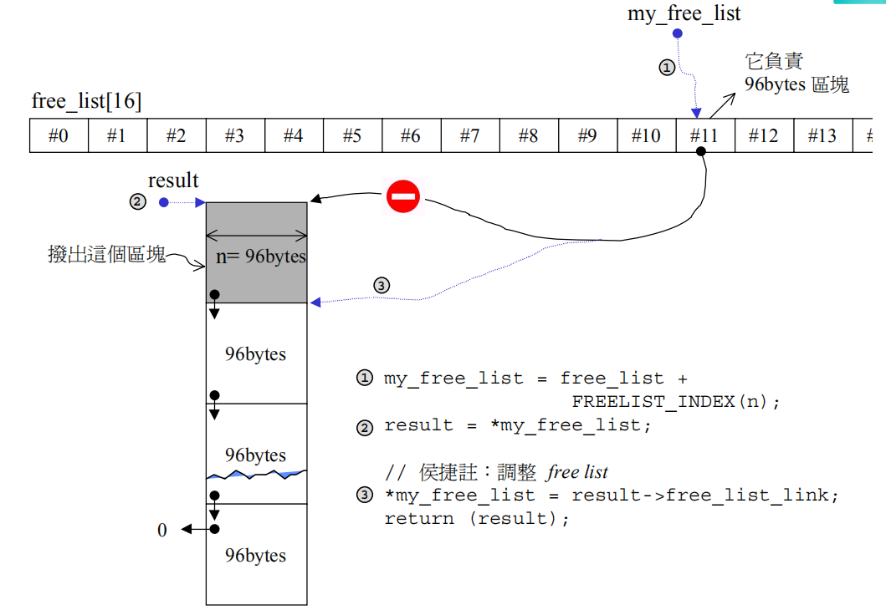
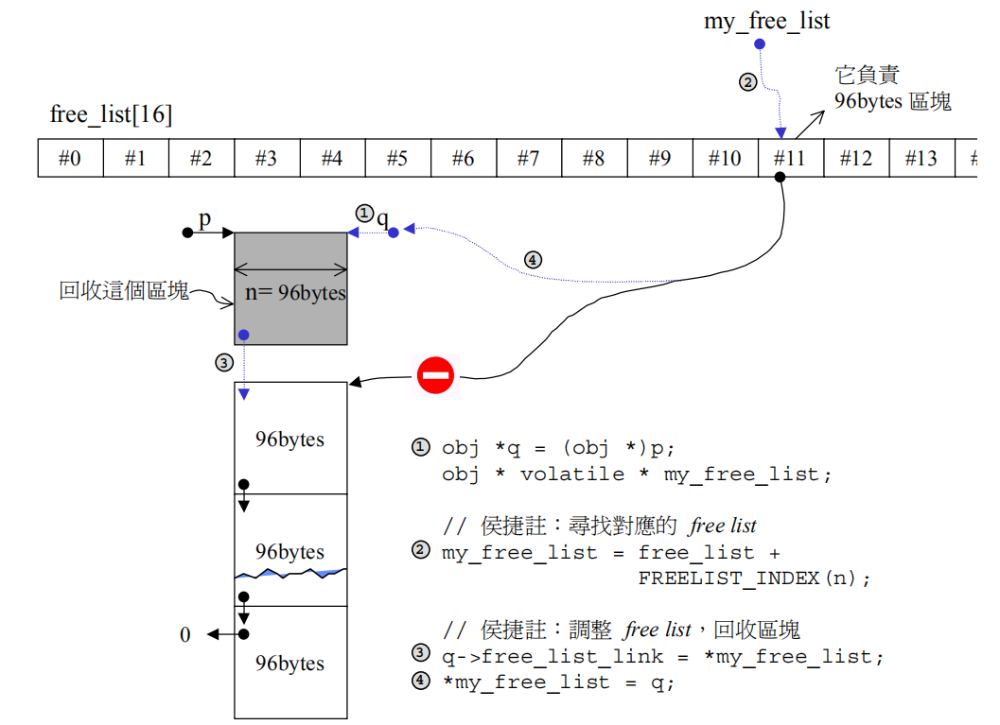
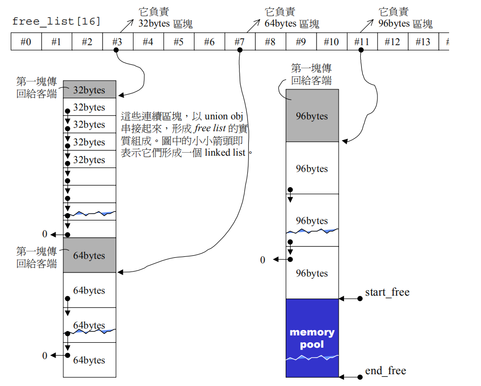

# STL - 内存分配 - 内存池

## 前言

本文为：STL源码分析第二章《allocator》的阅读记录。

如果具有很多小额区块的内存分配，那么采用直接分配的方式，不仅会产生很多的碎片内存，对这些空间进行管理也会带来额外的负担。

文中记录的方法是，如果区块够大，超过128bytes，就向系统直接申请对应的内存空间；当区块小于128bytes的时候，采用内存池进行管理，一次性申请大块的内存空间，用freelist管理剩余空间。为了方便管理，当申请小区块的时候，为将申请的空间上调至8的倍数，16个freelists，管理了大小分别为8,16,24,32,40,48,56,64,72,80,88,96,104,112,120,128bytes的小区块。

## 完整代码及流程示意图

```c++
#include <iostream>
#include <stdlib.h>
#include <memory.h>

namespace {
    
enum {__ALIGN = 8};
enum {__MAX_BYTES = 128};
enum {__NFREELISTS = __MAX_BYTES/__ALIGN};

template <bool threads, int inst/*not used*/>
class __default_alloc_template {
private:
    // 将bytes上调至8的倍数
    static size_t ROUND_UP(size_t bytes) {
        return (((bytes) + __ALIGN - 1) & ~(__ALIGN - 1));
    }

    union obj {
        union obj * free_list_link;
        char client_data[1];
    };

    static obj * volatile free_list[__NFREELISTS];
    static size_t FREELIST_INDEX(size_t bytes) {
        return (((bytes) + __ALIGN - 1) / __ALIGN - 1);
    }

    // 当发现list中没有足够的空间的时候，通过refill，
    // 传回一个大小为n的物件，并可能加入大小为n的其他区块到free list
    // 其中n已经上调至8的倍数
    static void* refill(size_t n)
    {
        int nobjs = 20;
        char * chunk = chunk_alloc(n, nobjs);

        obj * volatile * my_free_list;
        obj * result;
        obj * current_obj, * next_obj;

        if (1 == nobjs) return (chunk);
        
        my_free_list = free_list + FREELIST_INDEX(n);

        result = (obj*)chunk;
        *my_free_list = next_obj = (obj*)(chunk + n);
        for (int i = 1; ; i++) {
            current_obj = next_obj;
            next_obj = (obj*)((char*)next_obj + n);
            if (nobjs - 1 == i) {
                current_obj->free_list_link = 0;
                break;
            } else {
                current_obj->free_list_link = next_obj;
            }
        }
        return (result);
    }

    // 配置大块空间，可容纳nobjs个大小为“size”的区块
    // 如果，无法配置nobjs个区块，nobjs的值会减小
    static char* chunk_alloc(size_t size, int &nobjs)
    {
        char * result;
        size_t total_bytes = size * nobjs;
        size_t bytes_left = end_free - start_free;
        if (bytes_left >= total_bytes) {
            // 内存池中剩余空间完全满足需求量
            result = start_free;
            start_free += total_bytes;
            return result;
        } else if (bytes_left >= size) {
            // 内存池剩余空间不能完全满足需求量，但足够供应一个以上区块
            nobjs = bytes_left / size;
            total_bytes = size * nobjs;
            result = start_free;
            start_free += total_bytes;
            return result;
        } else {
            // 内存池剩余空间连一个区块大小都无法提供
            size_t bytes_to_get = 2 * total_bytes + ROUND_UP(heap_size >> 4);
            if (bytes_left > 0) {
                // 内存池汇中还有剩余，先配给适当的freelist
                obj * volatile * my_free_list = free_list + FREELIST_INDEX(bytes_left);
                // 调整freelist，将内存池剩余空间编入
                ((obj*)start_free)->free_list_link = *my_free_list;
                *my_free_list = ((obj*)start_free);
            }
            
            // 配置heap空间
            start_free = (char*)malloc(bytes_to_get);
            if (0 == start_free) {
                // heap 空间不足，malloc失败
                int i;
                obj * volatile * my_free_list, *p;
                // 尝试从freelist中查找是不是有足够大的没有用过的区块
                for (i = size; i <= __MAX_BYTES; i += __ALIGN) {
                    my_free_list = free_list + FREELIST_INDEX(i);
                    p = *my_free_list;
                    if (0 != p) {
                        *my_free_list = p->free_list_link;
                        start_free = (char*)p;
                        end_free = start_free + i;
                        return (chunk_alloc(size, nobjs));
                    }
                }
                end_free = 0;
                start_free = (char*)malloc(bytes_to_get); // 再次尝试，此处原本为malloc_alloc::allocate，内部实现，如果失败后会调用回调，然后再反复尝试
                if (0 == start_free)
                {
                    printf("out of memory\n");
                    exit(1);
                }
            }
            heap_size += bytes_to_get;
            end_free = start_free + bytes_to_get;
            // 调用自己，回了修正nobjs
            return (chunk_alloc(size, nobjs));
        }
    }

    // chunk allocation state
    static char *start_free; // 内存池的起始位置，只在chunk_alloc中变化
    static char *end_free;   // 内存池的结束位置，只在chunk_alloc中变化
    static size_t heap_size;

public:
    static void * allocate(size_t n) {
        obj * volatile * my_free_list;
        obj * result;

        // 大于最大值的时候直接分配内存
        if (n > (size_t) __MAX_BYTES)
            return malloc(n); // 此处不用，内存不足时，反复尝试的机制

        my_free_list = free_list + FREELIST_INDEX(n);
        result = *my_free_list;
        if (result == nullptr) {
            // 没有找到可用的freelist，准备重新填充freelist
            void *r = refill(ROUND_UP(n));
            return r;
        }

        *my_free_list = result->free_list_link;
        return (result);
    }
    static void deallocate(void *p, size_t n)
    {
        obj *q = (obj *)p;
        obj * volatile * my_free_list;

        // 大于最大值，直接释放内存
        if (n > (size_t) __MAX_BYTES) {
            free(p);
            return;
        }
        my_free_list = free_list + FREELIST_INDEX(n);
        q->free_list_link = *my_free_list;
        *my_free_list = q;
    }
};

template <bool threads, int inst>
typename __default_alloc_template<threads, inst>::obj * volatile 
    __default_alloc_template<threads, inst>::free_list[__NFREELISTS] = {0};

template<bool threads, int inst>
char *__default_alloc_template<threads, inst>::start_free = 0;

template<bool threads, int inst>
char *__default_alloc_template<threads, inst>::end_free = 0;

template<bool threads, int inst>
size_t __default_alloc_template<threads, inst>::heap_size = 0;

}

using My_Alloc = __default_alloc_template<false, 0>;


int main()
{
    int nCount = 4;
    int *a = (int *)My_Alloc::allocate(sizeof(int)*nCount);
    for (int i=0; i<nCount; ++i)
    {
        a[i] = i;
    }

    std::cout << "a[](" << a << "): ";
    for (int i=0; i<nCount; ++i)
    {
        std::cout << a[i] << " ";
    }

    My_Alloc::deallocate(a, sizeof(int)*nCount);

    std::cout << std::endl;
    std::cout << "a[](" << a << "): ";
    for (int i=0; i<nCount; ++i)
    {
        std::cout << a[i] << " ";
    }

    return 0;
}
```

输出为：

```
a[](00175A20): 0 1 2 3
a[](00175A20): 1530416 1 2 3
```

其中`static void * allocate(size_t n) `对应的示意图如下：



其中`static void deallocate(void *p, size_t n)`对应的示意图如下：




## 小结

整个过程对应的示意图如下：



整体流程大致说明：

- 一开始有个freelist列表，系统的内存空间；
- 请求分配内存；
- 如果分配的内存块很大，直接从系统内存中申请对应大小的内存空间返回；
- 如果分配的内存块比较小，从freelist中查找，
- 如果没找到，那么从memory pool中查找特定大小的内存空间，
- 如果还没找到，那么从系统内存中申请特定大小的内存空间，一部分返回放到memory pool，一部分返回放到freelist，还有一部分返回给内存申请者。

接下来就可以进一步理解《[learn nginx - 共享内存 - 小记](https://www.cnblogs.com/grass-and-moon/p/13689468.html)》。