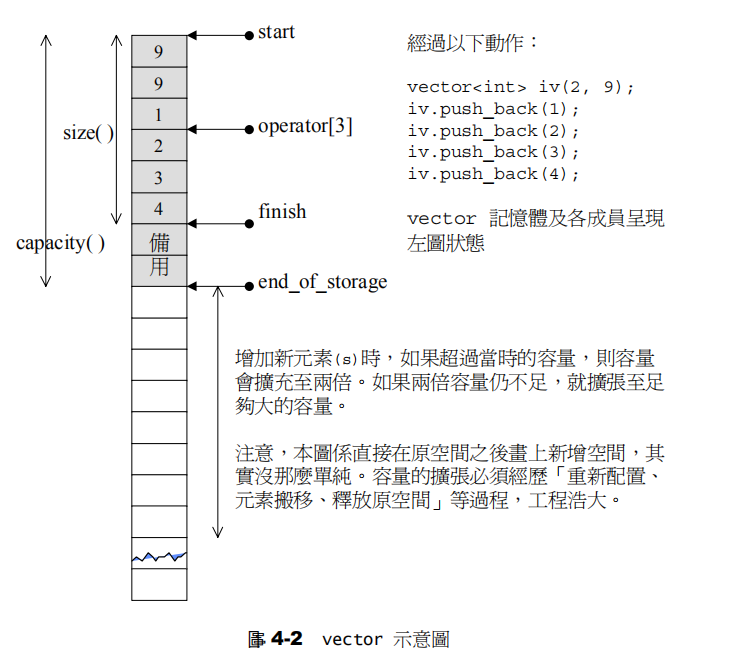
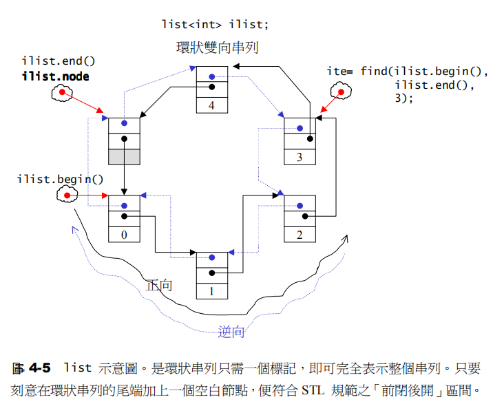
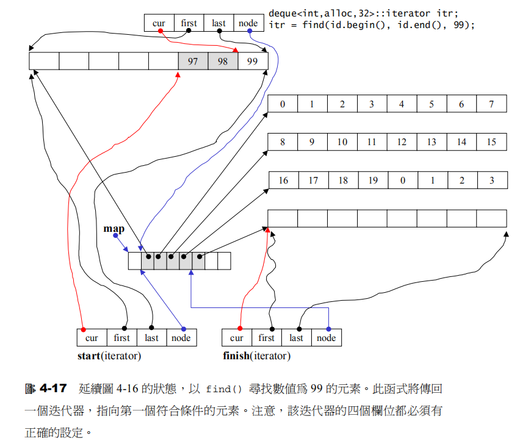
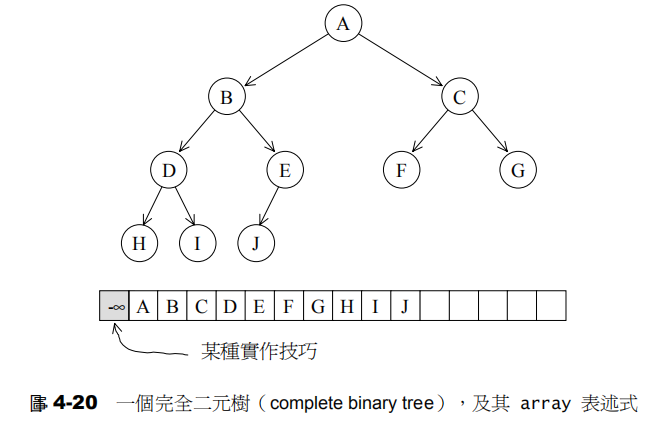
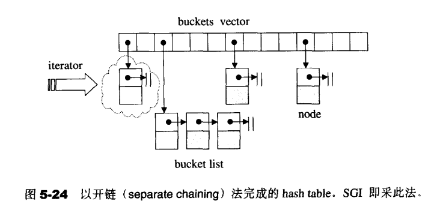

# STL - 容器内存存储结构

## 前言

本文为：STL源码分析第四章《sequence containers》和第五章《associated container》的阅读记录。

## vector

vector的使用参见：http://www.cplusplus.com/reference/vector/vector/?kw=vector

vector的内存存储空间是连续的，会先申请一篇特定大小的空间，当空间用完之后会进行扩容，扩容之后，需要将原先内存空间中的内容拷贝到新的内存空间中，最后把原来的空间释放还给内存，示意图如下所示。

## list

list的使用参见：http://www.cplusplus.com/reference/list/list/?kw=list

list在每次插入一个元素或删除一个元素的时候，就需要申请或释放一个元素空间，list的存储结构如下所示。

## deque

deque使用参见：http://www.cplusplus.com/reference/deque/deque/?kw=deque

deque是双向开口的连续线性空间，是由动态的分段连续空间组合而成，采用指针数组（map）对空间进行管理。与vector的最大差异是，1. 允许在常数时间内，在开头执行元素的插入或删除操作；2. 没有容量（capacity）的概念；3. 不需要像vector那样因为空间不足，重新分配更大的空间，并进行copy，释放空间的操作，直接申请适当的连续空间即可。

## stack，queue

内部存储结构默认使用deque

stack的使用参见：http://www.cplusplus.com/reference/stack/stack/?kw=stack

queue的使用参见：http://www.cplusplus.com/reference/queue/queue/?kw=queue

## heap（隐式结构）

heap使用参见：内部使用vector进行存储。

用vector来表示一个完全二叉树，示意图如下：

## priority_queue

内部使用heap进行存储。

priority_queue的使用参见：http://www.cplusplus.com/reference/queue/priority_queue/

## set/map/multiset/multimap 基于RB-tree

红黑树的介绍可以参见：

[史上最清晰的红黑树讲解（上）](https://www.cnblogs.com/CarpenterLee/p/5503882.html)

[史上最清晰的红黑树讲解（下）](https://www.cnblogs.com/CarpenterLee/p/5525688.html)

## hash_set, hash_map, hash_multiset, has_multimap基于hashtable

