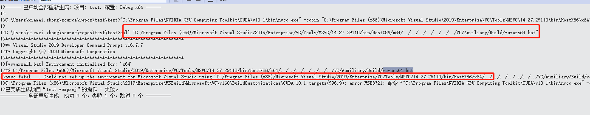

# Anaconda引起cuda MSB3721 with return error code 1

具体错误信息如下：

```
error MSB3721: 命令“"C:\Program Files\NVIDIA GPU Computing Toolkit\CUDA\v10.1\bin\nvcc.exe" -gencode=arch=compute_30,code=\"sm_30,compute_30\" -gencode=arch=compute_35,code=\"sm_35,compute_35\" -gencode=arch=compute_37,code=\"sm_37,compute_37\" -gencode=arch=compute_50,code=\"sm_50,compute_50\" -gencode=arch=compute_52,code=\"sm_52,compute_52\" -gencode=arch=compute_60,code=\"sm_60,compute_60\" -gencode=arch=compute_61,code=\"sm_61,compute_61\" -gencode=arch=compute_70,code=\"sm_70,compute_70\" -gencode=arch=compute_75,code=\"sm_75,compute_75\" --use-local-env -ccbin "C:\Program Files (x86)\Microsoft Visual Studio\2019\Enterprise\VC\Tools\MSVC\14.27.29110\bin\HostX86\x64" -x cu  -I./ -I../../common/inc -I./ -I"C:\Program Files\NVIDIA GPU Computing Toolkit\CUDA\v10.1\/include" -I../../common/inc -I"C:\Program Files\NVIDIA GPU Computing Toolkit\CUDA\v10.1\include"     --keep-dir x64\Release -maxrregcount=0  --machine 64 --compile -cudart static -Xcompiler "/wd 4819"    -DWIN32 -DWIN32 -D_MBCS -D_MBCS -Xcompiler "/EHsc /W3 /nologo /O2 /Fdx64/Release/vc142.pdb /FS /Zi  /MT " -o x64/Release/vectorAdd.cu.obj "C:\ProgramData\NVIDIA Corporation\CUDA Samples\v10.1\0_Simple\vectorAdd\vectorAdd.cu"”已退出，返回代码为 1。
```

网上有很多该问题的解决方法，提到的比较多的就是x64和86构建配置项的设置没有设对。但经过尝试均无效。最终发现cmd启动的时候，会从注册标准执行一个bat脚本（autorun），但是这个脚本找不到了，导致设置环境变量的时候出现了异常，对工程进行rebuild的时候发现如下错误信息：



最后经查找，问题的解决方式为：

https://blog.csdn.net/u011134502/article/details/94455355

原因是，之前安装Anaconda引起的。

