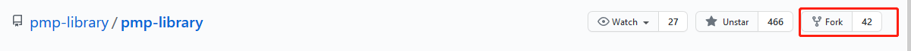

# 如何借助github贡献代码

首先确定感兴趣的项目，以[`pmp-library`](https://github.com/pmp-library/pmp-library)为例。

首先阅读对应项目的contributing：https://www.pmp-library.org/contributing.html。通常会介绍如何贡献代码。此处仅介绍github，git相关的工作流。

**1. fork项目**



**2. git clone 到本地**

`git clone --recursive https://github.com/grassofsky/pmp-library.git`

**3. 将upstream的代码更新到自己的仓库**

发现pmp-library接收pull request请求的分支为develop分支，因此相关的改动需要基于该分支进行。**此处假设，fork完代码之后，有很长一段时间没有动了，此时upstream中的代码已经发生了变化。**需要执行的命令如下：

```
git remote add upstream https://github.com/pmp-library/pmp-library.git
git remote -v           // 查看链接情况
git fetch upstream
git checkout develop
git rebase upstream/develop
```

这个时候本地仓库中的代码就和upstream中的代码一致了。此处使用的是rebase而不是merge，因为merge会带入其他的commit信息。而为了更好的和upstream代码保持一致，最好使用rebase。

然后上传到自己的github服务器：

```
git push origin
```

**4 创建自己的研发分支**

这个时候可以直接在develop的分支上进行新功能的添加，建议还是在develop的基础上，创建自己的研发分支，用于一次性功能添加。

```
git branch newdev
git checkout newdev
```

**5 添加新功能然后提交**

```
git add .
git commit -s -m "Add you comment"
git push origin
```

**6 进行pull request**

pull request可以参见：[github的pull Request使用](https://www.cnblogs.com/eyunhua/p/8433193.html)第四节。

## 参见

https://cloud.tencent.com/developer/article/1386036

