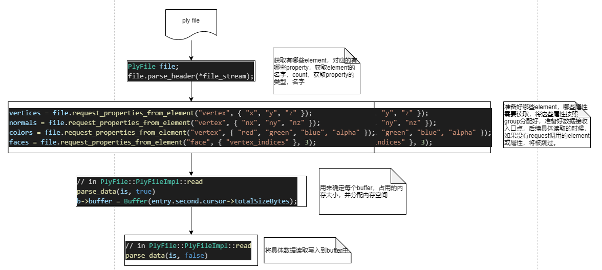

# Tinyply 源码阅读

ply格式介绍见：http://paulbourke.net/dataformats/ply/

tinyply项目路径为：https://github.com/ddiakopoulos/tinyply/

这里先放一个ply的示例：

```
ply   
format   ascii   1.0   
comment   author:   anonymous   
comment   object:   another   cube   
element   vertex   8   
property   float32   x   
property   float32   y   
property   float32   z   
property   uint8 red {   顶点颜色開始   }   
property   uint8 green      
property   uint8 blue
element   face   7   
property   list   uint8   int32   vertex_index   {   每一个面片的顶点个数   }   
element   edge   5   {   物体里有5条边   }   
property   int32   vertex1   {   边的第一个顶点的索引   }   
property   int32   vertex2   {   第二个顶点的索引   }   
property   uint8   red   {   边颜色開始   }   
property   uint8   green   
property   uint8   blue   
end_header   
0   0   0   255   0   0   {   顶点列表開始   }   
0   0   1   255   0   0   
0   1   1   255   0   0   
0   1   0   255   0   0   
1   0   0   0   0   255   
1   0   1   0   0   255   
1   1   1   0   0   255   
1   1   0   0   0   255   
3   0   1   2   {   面片列表開始，从一个三角形開始   }   
3   0   2   3   {   还有一个三角形   }   
4   7   6   5   4   {   如今是一些四边形   }   
4   0   4   5   1   
4   1   5   6   2   
4   2   6   7   3   
4   3   7   4   0   
0   1   255   255   255   {   边列表開始，从白边開始   }   
1   2   255   255   255   
2   3   255   255   255   
3   0   255   255   255   
2   0   0   0   0   {   以一个黑线结束   }   
```

## 主要数据结构

- Type，定义支持的数据类型；
- PropertyInfo，包装对应数据类型所占字节大小，以及对应的文本表示；
- Buffer
- PolyData？用来存储element对应的具体数据；
- PlyProperty，定义property对应的名字，以及类型，是不是list，以及list的大小；
- PlyElement，定义element对应的名字， 以及关联的PlyProperty
- PlyFile，文件解析的具体实现；
  - PlyFileImple: 文件解析的实现类，包括写入，读取；
    - PlyDataCursor: 用于数据定位；
    - ParsingHelper：用于辅助parsing；
    - PropertyLookup：方便查找element，对应的property所占内存大小；

## 文件解析流程

header解析：

```c++
//parse_header处理的token分别为：
// comment, format, element, property, obj_info, end_header
// read_header_element 构建：PlyElement对象，并附上name，和size的值
// read_header_property 将上一步构建的plyelement中填上，property（property type，和name）标识
bool PlyFile::PlyFileImpl::parse_header(std::istream & is)
{
    std::string line;
    bool success = true;
    while (std::getline(is, line))
    {
        std::istringstream ls(line);
        std::string token;
        ls >> token;
        if (token == "ply" || token == "PLY" || token == "") continue;
        else if (token == "comment")    read_header_text(line, comments, 8);
        else if (token == "format")     read_header_format(ls);
        else if (token == "element")    read_header_element(ls);
        else if (token == "property")   read_header_property(ls);
        else if (token == "obj_info")   read_header_text(line, objInfo, 9);
        else if (token == "end_header") break;
        else success = false; // unexpected header field
    }
    return success;
}
```

准备element对应的property描述：

```c++
std::shared_ptr<PlyData> PlyFile::PlyFileImpl::request_properties_from_element(const std::string & elementKey,
    const std::vector<std::string> propertyKeys,
    const uint32_t list_size_hint)
{
    if (elements.empty()) throw std::runtime_error("header had no elements defined. malformed file?");
    if (elementKey.empty()) throw std::invalid_argument("`elementKey` argument is empty");
    if (propertyKeys.empty()) throw std::invalid_argument("`propertyKeys` argument is empty");

    std::shared_ptr<PlyData> out_data = std::make_shared<PlyData>();

    const int64_t elementIndex = find_element(elementKey, elements);

    std::vector<std::string> keys_not_found;

    // Sanity check if the user requested element is in the pre-parsed header
    // 由element.name + property.name组成的唯一标识，并建立与ParsingHelper之间的关系
    // ParsingHelper内部的data用来存储具体数值的buffer空间（此时buffer空间被没有分配大小）
    if (elementIndex >= 0)
    {
        // We found the element
        const PlyElement & element = elements[elementIndex];

        // Each key in `propertyKey` gets an entry into the userData map (keyed by a hash of
        // element name and property name), but groups of properties (requested from the
        // public api through this function) all share the same `ParsingHelper`. When it comes
        // time to .read(), we check the number of unique PlyData shared pointers
        // and allocate a single buffer that will be used by each property key group.
        // That way, properties like, {"x", "y", "z"} will all be put into the same buffer.

        ParsingHelper helper;
        helper.data = out_data;
        helper.data->count = element.size; // how many items are in the element?
        helper.data->isList = false;
        helper.data->t = Type::INVALID;
        helper.cursor = std::make_shared<PlyDataCursor>();
        helper.list_size_hint = list_size_hint;

        // Find each of the keys
        for (const auto & key : propertyKeys)
        {
            const int64_t propertyIndex = find_property(key, element.properties);
            if (propertyIndex < 0) keys_not_found.push_back(key);
        }

        if (keys_not_found.size())
        {
            std::stringstream ss;
            for (auto & str : keys_not_found) ss << str << ", ";
            throw std::invalid_argument("the following property keys were not found in the header: " + ss.str());
        }

        for (const auto & key : propertyKeys)
        {
            const int64_t propertyIndex = find_property(key, element.properties);
            const PlyProperty & property = element.properties[propertyIndex];
            helper.data->t = property.propertyType;
            helper.data->isList = property.isList;
            auto result = userData.insert(std::pair<uint32_t, ParsingHelper>(hash_fnv1a(element.name + property.name), helper));
            if (result.second == false)
            {
                throw std::invalid_argument("element-property key has already been requested: " + element.name + " " + property.name);
            }
        }

        // Sanity check that all properties share the same type
        std::vector<Type> propertyTypes;
        for (const auto & key : propertyKeys)
        {
            const int64_t propertyIndex = find_property(key, element.properties);
            const PlyProperty & property = element.properties[propertyIndex];
            propertyTypes.push_back(property.propertyType);
        }

        if (std::adjacent_find(propertyTypes.begin(), propertyTypes.end(), std::not_equal_to<Type>()) != propertyTypes.end())
        {
            throw std::invalid_argument("all requested properties must share the same type.");
        }
    }
    else throw std::invalid_argument("the element key was not found in the header: " + elementKey);

    return out_data;
}
```

读取具体的element对应的property内容：

```c++
void PlyFile::PlyFileImpl::read(std::istream & is)
{
    std::vector<std::shared_ptr<PlyData>> buffers;
    for (auto & entry : userData) buffers.push_back(entry.second.data);

    // Discover if we can allocate up front without parsing the file twice
    // list_hints用于性能优化的目的
    uint32_t list_hints = 0;
    for (auto & b : buffers) for (auto & entry : userData) {list_hints += entry.second.list_size_hint;(void)b;}

    // No list hints? Then we need to calculate how much memory to allocate
    if (list_hints == 0)
    {
        // 第一遍parse_data用来分配需要的内存空间
        parse_data(is, true);
    }

    // Count the number of properties (required for allocation)
    // e.g. if we have properties x y and z requested, we ensure
    // that their buffer points to the same PlyData
    std::unordered_map<PlyData*, int32_t> unique_data_count;
    for (auto & ptr : buffers) unique_data_count[ptr.get()] += 1;

    // Since group-requested properties share the same cursor,
    // we need to find unique cursors so we only allocate once
    std::sort(buffers.begin(), buffers.end());
    buffers.erase(std::unique(buffers.begin(), buffers.end()), buffers.end());

    // 分配buffer对应的空间
    // We sorted by ptrs on PlyData, need to remap back onto its cursor in the userData table
    for (auto & b : buffers)
    {
        for (auto & entry : userData)
        {
            if (entry.second.data == b && b->buffer.get() == nullptr)
            {
                // If we didn't receive any list hints, it means we did two passes over the
                // file to compute the total length of all (potentially) variable-length lists
                if (list_hints == 0)
                {
                    b->buffer = Buffer(entry.second.cursor->totalSizeBytes);
                }
                else
                {
                    // otherwise, we can allocate up front, skipping the first pass.
                    const size_t list_size_multiplier = (entry.second.data->isList ? entry.second.list_size_hint : 1);
                    auto bytes_per_property = entry.second.data->count * PropertyTable[entry.second.data->t].stride * list_size_multiplier;
                    bytes_per_property *= unique_data_count[b.get()];
                    b->buffer = Buffer(bytes_per_property);
                }

            }
        }
    }

    // Populate the data
    // 此时，读取具体的数值
    parse_data(is, false);

    // In-place big-endian to little-endian swapping if required
    if (isBigEndian)
    {
        for (auto & b : buffers)
        {
            uint8_t * data_ptr = b->buffer.get();
            const size_t stride = PropertyTable[b->t].stride;
            const size_t buffer_size_bytes = b->buffer.size_bytes();

            switch (b->t)
            {
            case Type::INT16:   endian_swap_buffer<int16_t, int16_t>(data_ptr, buffer_size_bytes, stride);   break;
            case Type::UINT16:  endian_swap_buffer<uint16_t, uint16_t>(data_ptr, buffer_size_bytes, stride); break;
            case Type::INT32:   endian_swap_buffer<int32_t, int32_t>(data_ptr, buffer_size_bytes, stride);   break;
            case Type::UINT32:  endian_swap_buffer<uint32_t, uint32_t>(data_ptr, buffer_size_bytes, stride); break;
            case Type::FLOAT32: endian_swap_buffer<uint32_t, float>(data_ptr, buffer_size_bytes, stride);    break;
            case Type::FLOAT64: endian_swap_buffer<uint64_t, double>(data_ptr, buffer_size_bytes, stride);   break;
            default: break;
            }
        }
    }
}
```

parse_data的实现：

```c++
void PlyFile::PlyFileImpl::parse_data(std::istream & is, bool firstPass)
{
    std::function<void(PropertyLookup & f, const PlyProperty & p, uint8_t * dest, size_t & destOffset, std::istream & is)> read;
    std::function<size_t(PropertyLookup & f, const PlyProperty & p, std::istream & is)> skip;

    const auto start = is.tellg();

    uint32_t listSize = 0;
    size_t dummyCount = 0;
    std::string skip_ascii_buffer;

    // Special case mirroring read_property_binary but for list types; this
    // has an additional big endian check to flip the data in place immediately
    // after reading. We do this as a performance optimization; endian flipping is
    // done on regular properties as a post-process after reading (also for optimization)
    // but we need the correct little-endian list count as we read the file.
    auto read_list_binary = [this](const Type & t, void * dst, size_t & destOffset, const size_t & stride, std::istream & _is) noexcept
    {
        destOffset += stride;
        _is.read((char*)dst, stride);

        if (isBigEndian)
        {
            switch (t)
            {
            case Type::INT16:  *(int16_t*)dst  = endian_swap<int16_t, int16_t>(*(int16_t*)dst);    break;
            case Type::UINT16: *(uint16_t*)dst = endian_swap<uint16_t, uint16_t>(*(uint16_t*)dst); break;
            case Type::INT32:  *(int32_t*)dst  = endian_swap<int32_t, int32_t>(*(int32_t*)dst);    break;
            case Type::UINT32: *(uint32_t*)dst = endian_swap<uint32_t, uint32_t>(*(uint32_t*)dst); break;
            default: break;
            }
        }

        return stride;
    };

    if (isBinary)
    {
        read = [this, &listSize, &dummyCount, &read_list_binary](PropertyLookup & f, const PlyProperty & p, uint8_t * dest, size_t & destOffset, std::istream & _is) noexcept
        {
            if (!p.isList)
            {
                return read_property_binary(f.prop_stride, dest + destOffset, destOffset, _is);
            }
            read_list_binary(p.listType, &listSize, dummyCount, f.list_stride, _is); // the list size
            return read_property_binary(f.prop_stride * listSize, dest + destOffset, destOffset, _is); // properties in list
        };
        skip = [this, &listSize, &dummyCount, &read_list_binary](PropertyLookup & f, const PlyProperty & p, std::istream & _is) noexcept
        {
            if (!p.isList)
            {
                _is.read((char*)scratch, f.prop_stride);
                return f.prop_stride;
            }
            read_list_binary(p.listType, &listSize, dummyCount, f.list_stride, _is); // the list size (does not count for memory alloc)
            auto bytes_to_skip = f.prop_stride * listSize;
            _is.ignore(bytes_to_skip);
            return bytes_to_skip;
        };
    }
    else
    {
        read = [this, &listSize, &dummyCount](PropertyLookup & f, const PlyProperty & p, uint8_t * dest, size_t & destOffset, std::istream & _is) noexcept
        {
            if (!p.isList)
            {
                read_property_ascii(p.propertyType, f.prop_stride, dest + destOffset, destOffset, _is);
            }
            else
            {
                read_property_ascii(p.listType, f.list_stride, &listSize, dummyCount, _is); // the list size
                for (size_t i = 0; i < listSize; ++i)
                {
                    read_property_ascii(p.propertyType, f.prop_stride, dest + destOffset, destOffset, _is);
                }
            }
        };
        skip = [this, &listSize, &dummyCount, &skip_ascii_buffer](PropertyLookup & f, const PlyProperty & p, std::istream & _is) noexcept
        {
            skip_ascii_buffer.clear();
            if (p.isList)
            {
                read_property_ascii(p.listType, f.list_stride, &listSize, dummyCount, _is); // the list size (does not count for memory alloc)
                for (size_t i = 0; i < listSize; ++i) _is >> skip_ascii_buffer; // properties in list
                return listSize * f.prop_stride;
            }
            _is >> skip_ascii_buffer;
            return f.prop_stride;
        };
    }

    
    //“userData”表是一种简单的数据结构，用于从ply文件中获取用户想要的数据，
    // 但内部循环哈希查找并不理想。属性查找表将表向下展开为一个为解析优化的二维数组。
    // 第一个索引是元素，第二个索引是属性。 
    std::vector<std::vector<PropertyLookup>> element_property_lookup = make_property_lookup_table();
    size_t element_idx = 0;
    size_t property_idx = 0;
    ParsingHelper * helper {nullptr};

    // This is the inner import loop
    for (auto & element : elements)
    {
        for (size_t count = 0; count < element.size; ++count)
        {
            property_idx = 0;
            for (auto & property : element.properties)
            {
                // property lookup 存储了属性元素占用的空间，或list元素占用的空间
                PropertyLookup & lookup = element_property_lookup[element_idx][property_idx];

                if (!lookup.skip)
                {
                    helper = lookup.helper;
                    if (firstPass)
                    {
                        helper->cursor->totalSizeBytes += skip(lookup, property, is);

                        // These lines will be changed when tinyply supports
                        // variable length lists. We add it here so our header data structure
                        // contains enough info to write it back out again (e.g. transcoding).
                        if (property.listCount == 0) property.listCount = listSize;
                        if (property.listCount != listSize) throw std::runtime_error("variable length lists are not supported yet.");
                    }
                    else
                    {
                        read(lookup, property, helper->data->buffer.get(), helper->cursor->byteOffset, is);
                    }
                }
                else
                {
                    skip(lookup, property, is);
                }
                property_idx++;
            }
        }
        element_idx++;
    }

    // Reset istream position to the start of the data
    if (firstPass) is.seekg(start, is.beg);
}
```

### 文件解析流程小结

