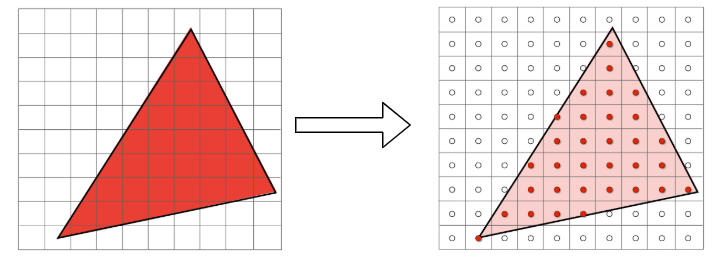
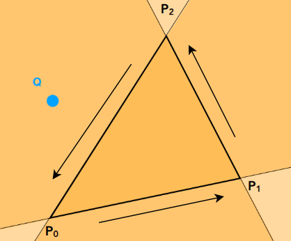
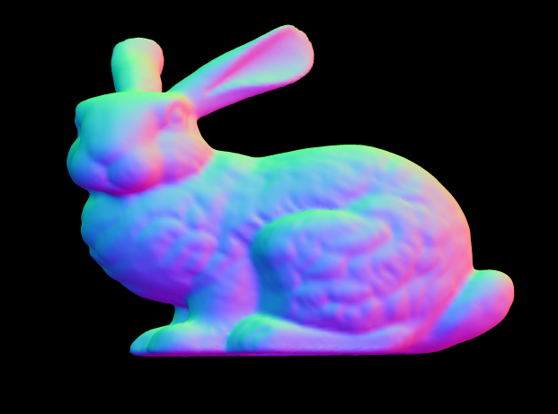

# 软光栅-uraster代码阅读（入门极品）

代码链接：https://github.com/Steve132/uraster

所有的代码都在`uraster.hpp`中。代码非常简单，适合初学者学习软光栅的实现。整个代码，在理解渲染管线基本流程的基础上，很容易理解，因此首先对渲染管线的基本流程进行介绍。

## 渲染管线流程介绍

详细内容可以参见：games101第5节课，和第6节课。

课程地址见：http://games-cn.org/intro-graphics/


上图取自https://learnopengl-cn.github.io/01%20Getting%20started/04%20Hello%20Triangle/。

此处重点关注：顶点数据、顶点着色器、光栅化、片段着色器。

作为输入的数据往往是三维顶点数据，这些顶点数据经过vertex shader，进行模型变换，视图变换，透镜变换，顶点的坐标会变成规范化后的坐标(-1,1)。结合最终图像的宽高就能够确定之前的三维上的点在二维上对应的位置。由于图像是由像素组成，是离散的。因此将连续的模型绘制到图像上的时候，需要进行光栅化的过程。光栅化之后，对每个光栅化的位置进行着色。

接下来重点介绍下如何进行光栅化。很容易想到可以利用采样的方式进行。如下图所示（from games 101）：



```c++
for (int i=0; i<width; ++i)
	for (int j=0; j<height; ++j)
        buffer[i,j] = f(i,j)
```

那么现在的重点就是，如何判断一个点是否位于三角形内部。

**判断点是否在三角形内（1）**



假如一个点在**P1P2**，**P2P0**，**P0P1**向量的同一边，那么点就在三角形内部，否则在三角形外部。

**判断点是否在三角形内（2）**

利用三角形的重心进行判断，三角形的重心是三角形三条中线的交点。如果有个一点满足如下性质：

$aP_0 + bP_1 + cP_2 = P_c, \ a + b + c = 1, \ a \ge 0,b\ge 0, c\ge 0$

那么点Pc就在三角形内部。

## uraster代码浏览

主要包括如下组成成分：

```c++
// 数据结构，类型
class Framebuffer; // 用来存储绘制的结果，内部就是个vector
struct BarycentricTransform; // functor 用来辅助计算重心坐标

// 函数
void run_vertex_shader(...);  // 用来执行外部传入进来的顶点着色器函数，用来进行模型视图投影变换，以及颜色设置
void rasterize_triangle(...); // 用来对三角形进行光栅化操作
void rasterize(...);          // 光栅化的总入口
void draw(...);               // 渲染操作的总入口
```

是不是很简单，作为入门材料实在是太合适了。从入口开始往后看，先看一下draw：

```c++
/// \param fb 用来存绘制结果
/// \param vertexbuffer_b 顶点存储空间开始的位置
/// \param vertexbuffer_e 顶点存储空间结束的位置
/// \param indexbuffer_b  索引存储空间开始的位置
/// \param indexbuffer_e 索引存储空间结束的位置
/// \param vcache_b vcache_e  存储顶点着色器之后的结果
/// \param vertex_shader 顶点着色器functor
/// \param fragment_shader 片段着色器functor
template<class PixelOut,class VertexVsOut,class VertexVsIn,class VertShader, class FragShader>
void draw(	Framebuffer<PixelOut>& fb,
		const VertexVsIn* vertexbuffer_b,const VertexVsIn* vertexbuffer_e,
		const std::size_t* indexbuffer_b,const std::size_t* indexbuffer_e,
		VertexVsOut* vcache_b,VertexVsOut* vcache_e,
		VertShader vertex_shader,
		FragShader fragment_shader)
{
	std::unique_ptr<VertexVsOut[]> vc;
    // 确保vcache_b的输出大小和顶点存储空间的大小一致
	if(vcache_b==NULL || (vcache_e-vcache_b) != (vertexbuffer_e-vertexbuffer_b))
	{
		vcache_b=new VertexVsOut[(vertexbuffer_e-vertexbuffer_b)];
		vc.reset(vcache_b);
	}
    // 运行顶点着色器
	run_vertex_shader(vertexbuffer_b,vertexbuffer_e,vcache_b,vertex_shader);
    // 运行光栅化
	rasterize(fb,indexbuffer_b,indexbuffer_e,vcache_b,fragment_shader);
}
```

主要看一下三角形光栅化的过程：

```c++
/// \brief 输入三角形的三个顶点，进行光栅化，并对每个位置利用片段着色器进行着色
template<class PixelOut,class VertexVsOut,class FragShader>
void rasterize_triangle(Framebuffer<PixelOut>& fb,const std::array<VertexVsOut,3>& verts,FragShader fragment_shader)
{
	std::array<Eigen::Vector4f,3> points{{verts[0].position(),verts[1].position(),verts[2].position()}};
	// 除以w项，将齐次坐标系转换成标准化的坐标系(-1,1）
	std::array<Eigen::Vector4f,3> epoints{{points[0]/points[0][3],points[1]/points[1][3],points[2]/points[2][3]}};
    // 获取xy位置
	auto ss1=epoints[0].head<2>().array(),ss2=epoints[1].head<2>().array(),ss3=epoints[2].head<2>().array();

	// 计算xy平面上的包围矩形
	Eigen::Array2f bb_ul=ss1.min(ss2).min(ss3);
	Eigen::Array2f bb_lr=ss1.max(ss2).max(ss3);
	Eigen::Array2i isz(fb.width,fb.height);	

	//将坐标映射为图像大小 (-1.0,1.0)->(0,imgdim)
	Eigen::Array2i ibb_ul=((bb_ul*0.5f+0.5f)*isz.cast<float>()).cast<int>();	
	Eigen::Array2i ibb_lr=((bb_lr*0.5f+0.5f)*isz.cast<float>()).cast<int>();
	ibb_lr+=1;	//add one pixel of coverage

	//clamp the bounding box to the framebuffer size if necessary (this is clipping.  Not quite how the GPU actually does it but same effect sorta).
    // 在结合图像区域，限定包围矩形
	ibb_ul=ibb_ul.max(Eigen::Array2i(0,0));
	ibb_lr=ibb_lr.min(isz);
	
    // 初始化重心坐标计算类
	BarycentricTransform bt(ss1.matrix(),ss2.matrix(),ss3.matrix());

	//for all the pixels in the bounding box
	for(int y=ibb_ul[1];y<ibb_lr[1];y++)
	for(int x=ibb_ul[0];x<ibb_lr[0];x++)
	{
        // 转换成-1到1的范围
		Eigen::Vector2f ssc(x,y);
		ssc.array()/=isz.cast<float>();	//move pixel to relative coordinates
		ssc.array()-=0.5f;
		ssc.array()*=2.0f;

		//Compute barycentric coordinates of the pixel center
        // 计算重心坐标
		Eigen::Vector3f bary=bt(ssc);
		
		//if the pixel has valid barycentric coordinates, the pixel is in the triangle
        // 重心坐标需要在0到1的范围内，点踩在三角形的范围内
		if((bary.array() < 1.0f).all() && (bary.array() > 0.0f).all())
		{
            // 计算这个点的深度信息
			float d=bary[0]*epoints[0][2]+bary[1]*epoints[1][2]+bary[2]*epoints[2][2];
			//Reference the current pixel at that coordinate
			PixelOut& po=fb(x,y);
			// if the interpolated depth passes the depth test
            // 进行深度测试
			if(po.depth() < d && d < 1.0)
			{
                // 计算当前点
				//interpolate varying parameters
				VertexVsOut v=verts[0];
				v*=bary[0];
				VertexVsOut vt=verts[1];
				vt*=bary[1];
				v+=vt;
				vt=verts[2];
				vt*=bary[2];
				v+=vt;
				
				//call the fragment shader
				po=fragment_shader(v);
				po.depth()=d; //write the depth buffer
			}
		}
	}
}
```

接着来看一下使用的时候需要注意什么：

```c++
struct XXXVertVsOut // 以下几个函数是必须的
{
    const Eigen::Vector4f& position() const;
    BunnyVertVsOut& operator+=(const BunnyVertVsOut& tp);
    BunnyVertVsOut& operator*(const float& f);
};

class XXXPixel
{
public:
    float& depth(); // 该函数也是必须的
};
```

放上示例程序跑出来的结果：

