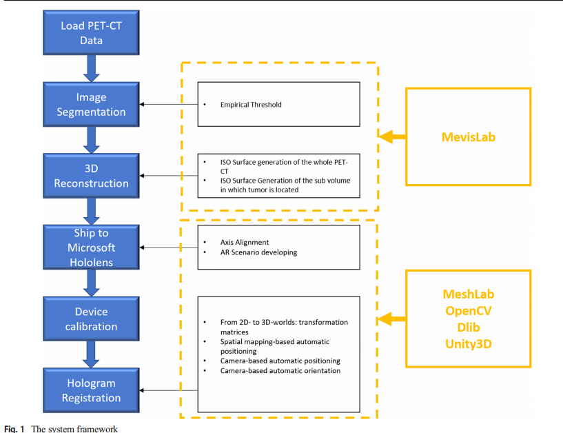
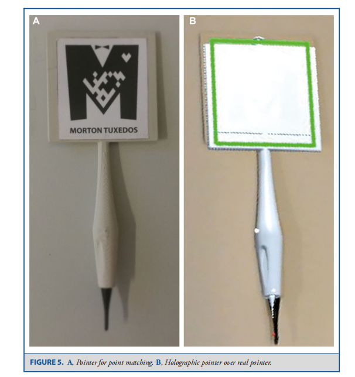
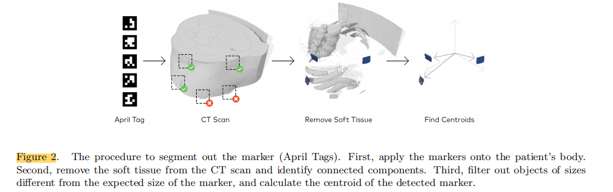
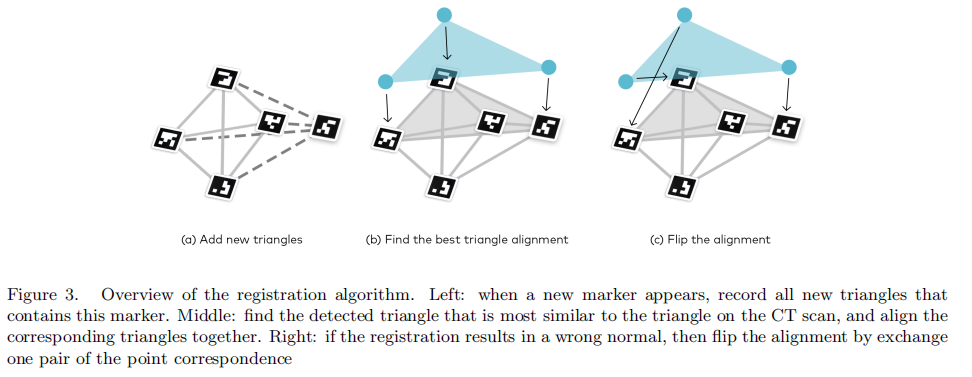
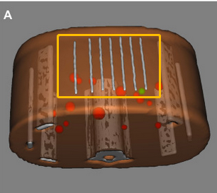

# Hololens配准调研

**关键词**：hololens，registration

**搜索网站**：xueshu.baidu.com

## 搜索结果简单描述

- [2019-*HoloLens*-Based AR System with a Robust Point Set *Registration* Algorithm](https://xueshu.baidu.com/usercenter/paper/show?paperid=156c02g0ee7h0m9056310t30tu254269&site=xueshu_se)：**hololens点云配准**算法
- [2019-Preliminary Experiment of the Interactive *Registration* of a Trocar for Thoracoscopy with *HoloLens* Headset](https://xueshu.baidu.com/usercenter/paper/show?paperid=1j5q0vh0ej410jf0y51t0p20vu667327&site=xueshu_se)： 本文利用Microsoft全息头戴式耳机，提出了第一个基于混合现实框架的套管针导引软件原型。外科医生首先使用CT扫描确定插入的位置和方向，以便在插入套管针时尽量减少损伤患者内脏的风险，然后在介入过程中交互式注册可能会帮助他或她。在本文中，我们描述了这种交互式配准的计算步骤序列和首次得到的结果。
- [Multicenter Assessment of Augmented Reality *Registration* Methods for Image-guided Interventions](https://xueshu.baidu.com/usercenter/paper/show?paperid=1q7c00d0ub2208e0rg6006m0u5151722&site=xueshu_se)：在将全息三维（3D）模型对准真实环境的过程中，**评估手动和自动配准时间以及增强现实的精度**。方法：在两个学术中心进行不同阶段临床训练的18名参与者连续3次使用**hololens2**增强现实耳机在CT网格上注册3D CT模型。比较不同注册方法（手势、Xbox控制器和自动注册）、临床经验水平和连续尝试的注册时间和准确性。配准时间也与之前的**hololens1**数据进行了比较。**没有介绍详细的配准方法**。
- [*Registration* made easy -- standalone orthopedic navigation with *HoloLens*](https://xueshu.baidu.com/usercenter/paper/show?paperid=1a090cy0w41j0ry0qt3108205p176916&site=xueshu_se)：我们提出一种手术导航方法，包括术中表面数字化注册和直观全息导航椎弓根螺钉放置完全在微软全息透镜上运行。模型实验的初步结果表明，该方法可以满足临床精度要求。
- [2019-A Marker-Less *Registration* Approach for Mixed Reality–Aided Maxillofacial Surgery: a Pilot Evaluation](https://xueshu.baidu.com/usercenter/paper/show?paperid=1f6006f0gh6x0jt0j53j0070x5584851&site=xueshu_se)：在这项工作中，我们设计了一个应用程序，**为病人的PET-CT信息无标记注册**。该算法结合了从**RGB视频流中提取的面部Marker**，以及HMD Microsoft HoloLens提供的所谓的**空间映射API**。
- 2018-[Development of a Mixed Reality Platform for Lateral Skull Base Anatomy](https://xueshu.baidu.com/usercenter/paper/show?paperid=1w470ak0k73x0r40jt0c0td0n0141011&site=xueshu_se)：
- 2019-[Clinical Accuracy of Holographic Navigation Using Point-Based *Registration* on Augmented-Reality Glasses](https://xueshu.baidu.com/usercenter/paper/show?paperid=1k130pp0hb5g0m80jy2u0pv08v442773&site=xueshu_se)：基于点云配准的精度分析
- 2018-[Augmenting Microsoft's *HoloLens* with vuforia tracking for neuronavigation](https://xueshu.baidu.com/usercenter/paper/show?paperid=161n0ch0qu700g40fr0y0ep093518880&site=xueshu_se)：下面的工作研究了使用专有图像处理**SDK Vuforia**对全息透镜的增强，允许整合来自其前置RGB相机的数据，以提供更稳定的空间全息图用于神经导航。
- 2019-[Joint Point Cloud and Image Based Localization For Efficient Inspection in Mixed Reality](https://xueshu.baidu.com/usercenter/paper/show?paperid=1y050ex0cf3r02x0vn1g0090gx615154&site=xueshu_se)：因此，我们提出了一种新的点云和基于图像的联合定位方法（JPIL）。
- 2020-[A research of surgical navigation system of mixed reality based on image *registration*](https://xueshu.baidu.com/usercenter/paper/show?paperid=120306a0a73r02p0n27s0rd01s245010&site=xueshu_se)：本文研究了一种更适合使用Microsoft全息镜头作为手术导航仪器的配准方法。手术导航过程中最重要的一步是将虚拟模型与相应的病灶进行配准。我们的配准方法主要是：首先利用vuforia中的三维模型识别进行粗配准，然后提取经过全息透镜扫描的模型和真实场景的点云数据，最后利用法向量几何特征提取点云数据的特征点，然后利用ICP算法进行精细配准。本文提出的配准方法解决了传统ICP算法容易陷入局部最优的问题，在一定程度上提高了配准精度。
- 2018-[Augmented Reality-Based Personalized Virtual Operative Anatomy for Neurosurgical Guidance and Training](https://xueshu.baidu.com/usercenter/paper/show?paperid=1a7000d0vq6k08r0cm4k0880gg264408&site=xueshu_se)：采用**精确的配准方法**映射虚拟现实空间信息，将虚拟手术大脑覆盖在工作空间上。？？**具体是什么方法呢？**
- 2019-[Image-based marker tracking and *registration* for intraoperative 3D image-guided interventions using augmented reality](https://xueshu.baidu.com/usercenter/paper/show?paperid=1j310tu0n90a0pb0696c0pu0qt612631&site=xueshu_se)：这里我们描述了一种使用Microsoft Hololens投影CT扫描，然后将投影与一组基准标记对齐的方法。在获取CT扫描之前，将带有**独特二维码的无线电不透明贴纸**贴在物体上。提取标记在CT扫描中的位置，并将CT扫描转换为三维表面对象。然后用全息透镜将三维物体投影到一张桌子上，上面放着同样的标记。我们设计了一个算法，将三维对象上的标记与表上的标记对齐。
- 2019-[Commentary: Clinical Accuracy of Holographic Navigation Using Point-Based *Registration* on Augmented-Reality Glasses](https://xueshu.baidu.com/usercenter/paper/show?paperid=1x1d0aw0v21a0rd0ku5k0x600d530351&site=xueshu_se)：配准精度分析；
- 2018-[Mixed_Reality_Guided_Radiofrequency_Needle_Placement_A_Pilot_Study](https://ieeexplore.ieee.org/document/8371236): 然后，采用定制的**精确配准方法**对虚拟现实空间信息进行映射。摘要中没有具体说明。
- 2019-[Pattern Recognition and Mixed Reality for Computer-Aided Maxillofacial Surgery and Oncological Assessment](https://xueshu.baidu.com/usercenter/paper/show?paperid=1h120g40c3370c30wu310ja0pg234512&site=xueshu_se)：因此采用模式识别算法在目标面部正确放置分段PET-CT扫描。为了记录这种系统的有效性和评价率，医生和工程师小组被要求根据标准ISO-9241/110评估和评估最终的原型。
- 2018-[Neurosurgical burr hole placement using the Microsoft *HoloLens*](https://xueshu.baidu.com/usercenter/paper/show?paperid=6e277ce3fee45f9662628c56aa7e3755&site=xueshu_se)：基于marker手动配准；
- 2019-[*Holo*Injection: augmented reality support for CT-guided spinal needle injections](https://xueshu.baidu.com/usercenter/paper/show?paperid=100n0840620r0m80b70t0x90hd012231&site=xueshu_se)：开发了一个原型AR应用程序，使用混合现实眼镜Microsoft HoloLens引导针头插入脊柱目标。在一项对比研究中，我们尝试测量系统的配准精度，并评估了三种关于可实现的面内和面外针定向误差的制导可视化概念。结果表明，AR原型具有较高的配准精度，可以有效地减小面外定位误差。
- 2020-[Augmented reality improves procedural  efficiency and reduces radiation dose for CT-guided lesion targeting: a  phantom study using HoloLens 2](https://www.ncbi.nlm.nih.gov/pmc/articles/PMC7596500/)

## 配准方法分类

- 基于marker的配准实现：
  - [2019-*HoloLens*-Based AR System with a Robust Point Set *Registration* Algorithm](https://xueshu.baidu.com/usercenter/paper/show?paperid=156c02g0ee7h0m9056310t30tu254269&site=xueshu_se)：
  - [*Registration* made easy -- standalone orthopedic navigation with *HoloLens*](https://xueshu.baidu.com/usercenter/paper/show?paperid=1a090cy0w41j0ry0qt3108205p176916&site=xueshu_se)
  - **重点关注**：[2019-A Marker-Less *Registration* Approach for Mixed Reality–Aided Maxillofacial Surgery: a Pilot Evaluation](https://xueshu.baidu.com/usercenter/paper/show?paperid=1f6006f0gh6x0jt0j53j0070x5584851&site=xueshu_se)
  - **重点关注**：2019-[Clinical Accuracy of Holographic Navigation Using Point-Based *Registration* on Augmented-Reality Glasses](https://xueshu.baidu.com/usercenter/paper/show?paperid=1k130pp0hb5g0m80jy2u0pv08v442773&site=xueshu_se)
  - 2019-[Joint Point Cloud and Image Based Localization For Efficient Inspection in Mixed Reality](https://xueshu.baidu.com/usercenter/paper/show?paperid=1y050ex0cf3r02x0vn1g0090gx615154&site=xueshu_se)
  - 2020-[A research of surgical navigation system of mixed reality based on image *registration*](https://xueshu.baidu.com/usercenter/paper/show?paperid=120306a0a73r02p0n27s0rd01s245010&site=xueshu_se)
  - 2018-[Augmented Reality-Based Personalized Virtual Operative Anatomy for Neurosurgical Guidance and Training](https://xueshu.baidu.com/usercenter/paper/show?paperid=1a7000d0vq6k08r0cm4k0880gg264408&site=xueshu_se)：**借助NDI，hololens上面安装marker，实现空间配准；**
  - **重点关注**：2019-[Image-based marker tracking and *registration* for intraoperative 3D image-guided interventions using augmented reality](https://xueshu.baidu.com/usercenter/paper/show?paperid=1j310tu0n90a0pb0696c0pu0qt612631&site=xueshu_se)：**基于视觉识别的方法**
  - 2018-[Mixed_Reality_Guided_Radiofrequency_Needle_Placement_A_Pilot_Study](https://ieeexplore.ieee.org/document/8371236): **利用了NDI**
  - 2019-[*Holo*Injection: augmented reality support for CT-guided spinal needle injections](https://digital-library.theiet.org/content/journals/10.1049/htl.2019.0062)：Optical Tracking
  - **重点关注：2020-[Augmented reality improves procedural  efficiency and reduces radiation dose for CT-guided lesion targeting: a  phantom study using HoloLens 2](https://www.ncbi.nlm.nih.gov/pmc/articles/PMC7596500/)** **hololens2 and Vuforia** 
- 手动配准实现：
  - [2019-Preliminary Experiment of the Interactive *Registration* of a Trocar for Thoracoscopy with *HoloLens* Headset](https://xueshu.baidu.com/usercenter/paper/show?paperid=1j5q0vh0ej410jf0y51t0p20vu667327&site=xueshu_se)：future work：我们继续我们的工作，以便通过使用Unity最近提供的基于标记的功能来简化注册过程（**Vuforia library**）
  - 2018-[Development of a Mixed Reality Platform for Lateral Skull Base Anatomy](https://xueshu.baidu.com/usercenter/paper/show?paperid=1w470ak0k73x0r40jt0c0td0n0141011&site=xueshu_se)
  - **2018-[Augmenting Microsoft's *HoloLens* with vuforia tracking for neuronavigation](https://xueshu.baidu.com/usercenter/paper/show?paperid=161n0ch0qu700g40fr0y0ep093518880&site=xueshu_se)：Vuforia Tracking**
  - 2018-[Neurosurgical burr hole placement using the Microsoft *HoloLens*](https://xueshu.baidu.com/usercenter/paper/show?paperid=6e277ce3fee45f9662628c56aa7e3755&site=xueshu_se)

## 配准具体实现

### **重点关注**：[2019-A Marker-Less *Registration* Approach for Mixed Reality–Aided Maxillofacial Surgery: a Pilot Evaluation](https://xueshu.baidu.com/usercenter/paper/show?paperid=1f6006f0gh6x0jt0j53j0070x5584851&site=xueshu_se)

使用到的软件有：

- MeVisLab，用于重建分割，网格生成；
- OpenCV for Unity
- Dlib FaceLandmarkDetector
- Unity3D, Hololens, VS2017, HoloToolkit

利用 facial landmark detection进行配准。

完整的流程图如下：

详细说明如下：

- hololens利用RGB相机以及Dlib获取facial landmarkers (https://www.cv-foundation.org/openaccess/content_cvpr_2014/papers/Kazemi_One_Millisecond_Face_2014_CVPR_paper.pdf)
- 上一步骤获取的是二维的坐标，需要转换成三维的坐标，通过相机内参，和hololens[相机在世界坐标系的位置](https://docs.microsoft.com/en-us/windows/mixed-reality/develop/platform-capabilities-and-apis/locatable-camera)（表示它的6个degrees of freedom，DoF），以及通过[ Spatial Mapping scene 使用unity raycasting算法](https://docs.unity3d.com/ScriptReference/Physics.Raycast.html) ，将二维点变换到到世界坐标系下面的点；
- .

**没看懂获取的facial landmarker怎么用来配准的？就算知道了facial landmarker对应的3D坐标？**

### **重点关注**：2019-[Clinical Accuracy of Holographic Navigation Using Point-Based *Registration* on Augmented-Reality Glasses](https://xueshu.baidu.com/usercenter/paper/show?paperid=1k130pp0hb5g0m80jy2u0pv08v442773&site=xueshu_se)

基准配准误差（FRE）定义为两点云中对应皮肤基准点之间距离的均方根（RMS）。

因此，我们决定使用手动基准点匹配使用迭代最近点算法。 利用HN(holographic navigation)应用程序进行点匹配，以匹配真实物体上的虚拟全息图。HN应用能够自动计算出FRE。使用到的marker如下：

左边是3D打印出来的结果，当HN识别pointer后，会自动的将全息影像投影到实际物体，显示右边的结果。

具体操作过程如下：

- 在网格数据中选择对应的标记点（MarkersA）；
- 使用实际的pointer指向实际物体的标记点的位置，当HN识别实际pointer之后，会自动的将全息影像投影到实际物体，voice命令（Point），就会在实际标记点出添加虚拟标记点（**该识别过程利用了：image-recognition Vuforia Library**）。
- 对所有的标记点执行相同的处理过程，添加的所有的标记点为（MarkersB）；
- 执行“an iterative closest point algorithm”，将MarkersA和MarkersB进行配准；
- 完成实际对象和虚拟对象直接的配准过程；

### **重点关注**：2019-[Image-based marker tracking and *registration* for intraoperative 3D image-guided interventions using augmented reality](https://xueshu.baidu.com/usercenter/paper/show?paperid=1j310tu0n90a0pb0696c0pu0qt612631&site=xueshu_se)

- 在CT扫描之前，需要将VisiMarker方式到对象的皮肤上；
- 利用ChARUCO和针孔相机模型，标定holollens的内参；
- 其次，为了校正全息图和相应标记之间的错位，对全息图的位置偏移进行测量、建模和校正；
- CT数据中分割出marker（April Tags）；
- 将CT数据中分割出来的marker和看到的marker进行比对，完成配准过程；

最后两部的示意图如下：

### **重点关注：2020-[Augmented reality improves procedural  efficiency and reduces radiation dose for CT-guided lesion targeting: a  phantom study using HoloLens 2](https://www.ncbi.nlm.nih.gov/pmc/articles/PMC7596500/)** **hololens2 and Vuforia** 

关键内容如下：

Automated registration of the 3D model to CT grid was performed using  computer vision and Vuforia 9.0.12 with the CT grid as the image target. Features on the CT grid can be reliably and quickly detected by Vuforia[12](https://www.ncbi.nlm.nih.gov/pmc/articles/PMC7596500/#CR12), and studies have validated the accuracy of Vuforia on HoloLens。

CT grid如下图：

利用grid完成配准。

## others

- optitrack for unity ：https://optitrack.com/support/downloads/plugins.html#unity-plugin