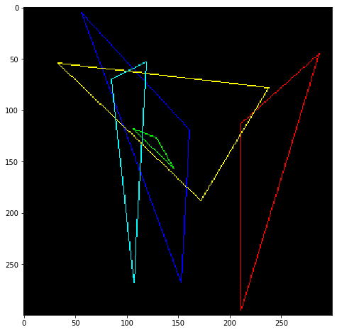

# Tinyrender-Lesson 1 Bresenham’s Line Drawing Algorithm

原文：https://github.com/ssloy/tinyrenderer/wiki/Lesson-1-Bresenham%E2%80%99s-Line-Drawing-Algorithm

关于该绘制直线算法的另外介绍：https://www.cnblogs.com/wlzy/p/8695226.html

## First attempt

给定一条线的两个点，先用最简单的插值方式进行实现，具体如下：


```python
import matplotlib.pyplot as plt
from PIL import Image
import numpy as np
```


```python
def draw_line(image, p0, p1,color=(255,0,0), step=0.1):
    x = np.arange(p0[0], p1[0]+step, step)
    y = np.arange(p0[1], p1[1]+step, step)
    for (x,y) in zip(x,y):
        image.putpixel((int(x), int(y)), color)
```


```python
image1 = Image.new("RGB",(100, 100),(0,0,0))
draw_line(image1, (13,20), (80, 40), color=(255,255,255), step=0.01)

fig = plt.figure(figsize=(30,300))
ax = fig.add_subplot(131)
ax.imshow(image1)
ax.set_title("step=0.01")

image2 = Image.new("RGB",(100, 100),(0,0,0))
draw_line(image2, (13,20), (80, 40), color=(255,255,255), step=0.1)
ax = fig.add_subplot(132)
ax.imshow(image2)
ax.set_title("step=0.1")

image3 = Image.new("RGB",(100, 100),(0,0,0))
draw_line(image3, (13,20), (80, 40), color=(255,255,255), step=1.0)
ax = fig.add_subplot(133)
ax.imshow(image3)
ax.set_title("step=1")

```


```python
print("image with step0.01 is equal to step0.1? ", image1 == image2)
print("image with step0.01 is equal to step1? ", image1 == image3)
```

    image with step0.01 is equal to step0.1?  True
    image with step0.01 is equal to step1?  False


## Second attempt

第一次尝试得到的结果是，step为0.1和0.01的时候得到相同的结果，但是在0.01的时候需要更多的遍历，会降低性能。为了降低性能，我们进行如下尝试，利用起止点的x值来计算采样步长，对y值进行采样：


```python
def draw_line2(p0, p1, color, fig, pos):
    image = Image.new("RGB",(100, 100),(0,0,0))
    # 计算x值
    step = 1 if p1[0] > p0[0] else -1
    x = np.arange(p0[0], p1[0]+step, step)
    # 计算采样步长
    t = (x - p0[0])/(p1[0] - p0[0])
    # 对y进行采样
    y = p0[1]*(1 - t) + p1[1] * t;
    for (a, b) in zip(x, y):
        image.putpixel((int(a),int(b)), color)
    ax = fig.add_subplot(pos)
    ax.imshow(image)

```


```python
fig = plt.figure(figsize=(30,300))

draw_line2((13, 20), (80, 40), (255, 255, 255), fig, 131)
draw_line2((20, 13), (40, 80), (255, 0, 0), fig, 132)
draw_line2((80, 40), (13, 20), (255, 0, 0), fig, 133)
```


从上面的结果可以发现，当x方向的距离小于y方向的距离的时候会导致采样不足。第二个图点和点之间出现了空洞。下面进行第三次尝试。

## Third attempt


```python
def draw_line3(p0, p1, color, fig, pos):
    image = Image.new("RGB",(100, 100),(0,0,0))
    
    distance = abs(np.array(p0)-np.array(p1))
    # 确定距离大的一方，来确定采样步长
    maxIndex = 0 if distance[0] > distance[1] else 1
    # 计算采样步长
    step = 1 if p1[maxIndex] > p0[maxIndex] else -1
    pt_1 = np.arange(p0[maxIndex], p1[maxIndex] + step, step)
    t = (pt_1 - p0[maxIndex]) / (p1[maxIndex] - p0[maxIndex])
    # 对另一方，按照步长进行采样
    pt_2 = p0[1-maxIndex] * (1 - t) + p1[1-maxIndex]* t
    
    for (a, b) in zip(pt_1, pt_2):
        if maxIndex == 0:  # 说明xy顺序没有发生变化
            image.putpixel((int(a),int(b)), color)
        else:              # 说明xy顺序进行了调整
            image.putpixel((int(b), int(a)), color)
    ax = fig.add_subplot(pos)
    ax.imshow(image)
```


```python
fig = plt.figure(figsize=(30,300))

draw_line3((13, 20), (80, 40), (255, 255, 255), fig, 131)
draw_line3((20, 13), (40, 80), (255, 0, 0), fig, 132)
draw_line3((80, 40), (13, 20), (255, 0, 0), fig, 133)
```


## Fourth attempt

python关于性能分析和时间统计可以参考：https://blog.csdn.net/lhh08hasee/article/details/80032193 此处不进行额外的介绍。详细可以参见原文。从理论上理解，以较长距离的维度来确定采样步长，那么在较短的维度上进行采样的时候，会采样得到比实际像素点多很多的点。举个例子：P1(20,20), P2(80,30),
那么采样点的数量会有80-20=60个点，而较短的维度上的像素距离仅有10个点，那么久没必要采样60个点。因此可以程序进行优化：


```python
def draw_line4(p0, p1, color, fig, pos):
    image = Image.new("RGB",(100, 100),(0,0,0))
    
    distance = abs(np.array(p0)-np.array(p1))
    # 确定距离大的一方，来确定采样步长
    maxIndex = 0 if distance[0] > distance[1] else 1
    minIndex = 1 - maxIndex

    # 计算采样步长
    step1 = 1 if p1[maxIndex] > p0[maxIndex] else -1
    step2 = 1 if p1[minIndex] > p0[minIndex] else -1
    
    # 计算另一方，一个采样步长对应的递增步长
    dy = abs((p1[minIndex] - p0[minIndex])/(p1[maxIndex] - p0[maxIndex]))
    
    b = p0[minIndex]
    error = 0
    for a in range(p0[maxIndex], p1[maxIndex] + step1, step1):
        if maxIndex == 0: # 说明xy顺序没有发生变化
            image.putpixel((int(a),int(b)), color)
        else:
            image.putpixel((int(b), int(a)), color)
        error = error + dy
        if error > 0.5:
            b = b + step2
            error = error - 1.            
    ax = fig.add_subplot(pos)
    ax.imshow(image)
```


```python
fig = plt.figure(figsize=(30,300))

draw_line4((13, 20), (80, 40), (255, 255, 255), fig, 131)
draw_line4((20, 13), (40, 80), (255, 0, 0), fig, 132)
draw_line4((80, 40), (13, 20), (255, 0, 0), fig, 133)
```


## Timings: fifth and final attempt

第5次尝试中，将浮点型替换成了整型，这里就不进行第5次尝试了。

## wireframe rendering

绘制平面三角形线。


```python
def generate_triangle2d(num, max_value):
    return np.random.choice(range(0, max_value), size=(num, 3, 2))

                            
def draw_line5(p0, p1, image, color):
    distance = abs(np.array(p0)-np.array(p1))
    # 确定距离大的一方，来确定采样步长
    maxIndex = 0 if distance[0] > distance[1] else 1
    minIndex = 1 - maxIndex

    # 计算采样步长
    step1 = 1 if p1[maxIndex] > p0[maxIndex] else -1
    step2 = 1 if p1[minIndex] > p0[minIndex] else -1
    
    # 计算另一方，一个采样步长对应的递增步长
    dy = abs((p1[minIndex] - p0[minIndex])/(p1[maxIndex] - p0[maxIndex]))
    
    b = p0[minIndex]
    error = 0
    for a in range(p0[maxIndex], p1[maxIndex] + step1, step1):
        if maxIndex == 0: # 说明xy顺序没有发生变化
            image.putpixel((int(a),int(b)), color)
        else:
            image.putpixel((int(b), int(a)), color)
        error = error + dy
        if error > 0.5:
            b = b + step2
            error = error - 1.
```


```python
triangle_num = 5
image = Image.new("RGB", (300, 300), (0,0,0))
triangles3d = generate_triangle2d(triangle_num, 300)

color = [(255, 0, 0), (0, 255, 0), (0, 0, 255), (255,255,0), (0,255,255)]
for i in range(triangle_num):
    draw_line5(triangles3d[i][0], triangles3d[i][1], image, color[i])
    draw_line5(triangles3d[i][1], triangles3d[i][2], image, color[i])
    draw_line5(triangles3d[i][2], triangles3d[i][0], image, color[i])
    
fig = plt.figure(figsize=(8,8))
ax = fig.add_subplot(111)
ax.imshow(image)
```



