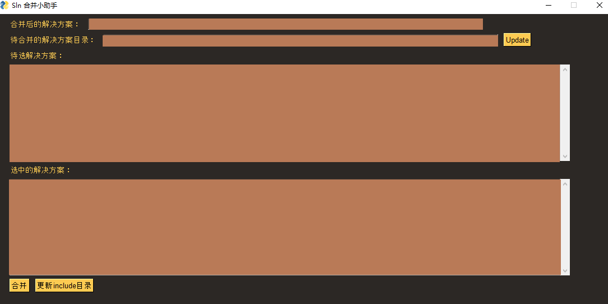
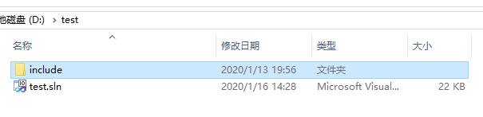

# [小工具] 解决方案合并

## 问题描述

通常在浏览代码，或调试代码的时候会涉及到多个解决方案，而visual studio（目前版本2010）在使用的时候只能同时打开一个解决方案，那么通常情况下有如下处理方式：

- 针对代码浏览，使用新的工具浏览代码，如vscode，source insight等；
- 针对代码调试，在当前调试的解决方案中，将相关的其他解决方案的cpp代码添加到当前的解决方案中。

但是上面的两种方式在具体实施的时候，效率还是不高。因此此处给出解决方案合并的途径。

## 合并工具

https://github.com/grassofsky/merge-solutions-vs2010，从别人的地方fork过来的。生成后可以得到merge-solutions.exe，使用介绍如下：

```
merge-solutions.exe [/nonstop] [/fix] [/config solutionlist.txt] [/out merged.sln] [solution1.sln solution2.sln ...]
        /fix: Regenerates duplicate project guids and replaces them in corresponding project/solution files
              requires write-access to project and solution files
        /config solutionlist.txt: Takes list of new-line separated solution paths from solutionlist.txt file
        /out merged.sln: path to output solution file. Default is 'merged.sln'
        /nonstop: don't prompt for keypress if there were errors/warnings
        solution?.sln - list of solutions to be merged
```

而在代码管理书写的时候，有些include目录可能位于：`$(SolutionDir)include`目录下面，而合并成新的solution之后，该目录下面就会找不到对应的include目录。因此在合并之后还需要进行的操作是将对应各个解决方案中include下面的文件拷贝到新的解决方案的include目录下。

为了更加方便使用。下面提供了UI操作小工具，如下。

## 合并工具GUI版本

相关截图如下：






代码见：

[请挪步](../../script/merge_solution)

## 其他

针对其他版本的visual studio也可以利用类似的方式实现。

